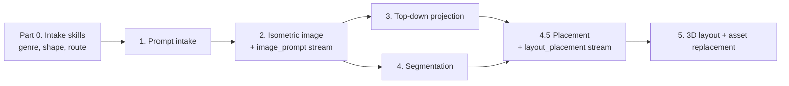

# **LayoutGen — Pipeline & Routing**

This document describes the **3D layout-generation pipeline** used to turn a text prompt into a playable Roblox layout, the **assumptions baked into that pipeline**, the **ways it fails**, and two **decision trees** that decide how to run it:

* **Decision Tree A — Pipeline Routing:** how to *modify* the pipeline based on the game that was prompted.
* **Decision Tree B — Prompt Sufficiency:** how to *guide the user* when their prompt is too narrow (under-specified) or asks for something the pipeline can't capture as-is.

It is a **companion** to `LayoutGen - Build.md`. That doc defines *what* a game of a given genre needs (layout options, presets, shared vocabulary). This doc defines *how* we generate the layout and *when the generation approach must change*. Wherever this doc says "genre profile," it refers to `LayoutGen - Build.md`.

**Intake is now implemented as skills**, not as prose in this document. `.cursor/skills/layout-intake/` and `.cursor/skills/genre-choice/` are the executable form of Part V's Decision Tree B and of the genre lookup in Part VI. Part 0 below describes what they hand over; the two Parts note where the skill now owns behaviour this document used to only describe.

---

# **Part 0 — Intake (the skills layer)**

Everything upstream of the image model is handled by two skills before the pipeline proper starts.

1. **`layout-intake`** reads the prompt and decides which *concerns* it touches — genre, visual theme, and spatial scale today, with goal / win-condition still unassigned. It dispatches each and assembles one handoff.
2. **`genre-choice`** classifies the prompt in two stages. Stage A matches a genre (Genre / Mixed / Unrecognised / None). Stage B asks *does the player move through a space?* of every outcome and routes **P5** when the answer is no — this is where the non-spatial cutoff now lives, replacing the `Q0` node in Part IV's tree.
3. The user is offered a **preset** (one decision), can tune the **shape** and `Core` options, and gets one open question. Caps are one clarifying question, five items on screen, one open question.
4. The skill emits a JSON block: the genre, the shape, the pipeline route, and the picks **split into two streams**.

### **The two streams — what the pipeline receives**

The handoff does not give the pipeline one undifferentiated wish-list. Every option in Build.md carries a **`Goes to`** tag, and the skill splits on it:

| Stream | Meaning | Consumed by |
| :---- | :---- | :---- |
| `image_prompt` | Visible geometry — a segmenter could identify it. | **Injected into phase 2**, the isometric generation prompt. |
| `layout_placement` | Invisible or non-geometric — a trigger volume, a spawn marker, a pickup, an emitter. | **Applied at phase 4.5**, against the already-segmented layout. |

An option tagged `both` appears in both streams: the visible half is drawn, the functional half is placed. For anything free-text with no tag to look up, the skill applies the rule *if a segmenter could identify it as geometry it is `image`; if it is an invisible volume, a marker, a trigger, or a property of geometry rather than geometry itself, it is `layout`.*

This matters to the pipeline for two reasons. It is what keeps the image prompt from being saturated with things the image model cannot draw, and it is the source of the phase 4.5 work list, which had no home before.

```json
{ "genres": ["shooter"],
  "shape": { "id": "lane-network", "type": "Lane", "name": "Lane Network" },
  "preset": "Bomb Defusal",
  "pipeline": ["P0"],
  "image_prompt": [ { "id": "cover-los", "text": "Waist-high and full-body cover distributed evenly across every lane" } ],
  "layout_placement": [ { "id": "spawn-teambase", "type": "SpawnZone", "text": "Balanced bases at opposite ends" } ] }
```

---

# **Part I — The Pipeline (As-Is)**

The current pipeline is a linear, single-pass flow:

1. **Prompt intake.** The user writes free text describing their game. This ranges from a few words ("make me a game like Pac-Man," "a roller-coaster tycoon," "an infinite runner where I dodge zombies and aliens") to a full one-page design essay. **Part 0 turns this into a structured handoff**, including the pipeline route, before phase 2 runs.
2. **Prompt → Isometric image.** The prompt plus the handoff's `image_prompt` stream is sent to an LLM/image model that generates **one isometric render of the whole game layout**.
3. **Isometric → Top-down.** The isometric image is reprojected into a single top-down plan view.
4. **Isometric → Segmentation.** The isometric image is segmented into typed components: `Path`s, `Barrier`s (walls/fences), buildings, props, terrain, etc. (using the shared vocabulary from `LayoutGen - Build.md`).
5. **Layout → 3D → Asset replacement.** The plan is reconstructed in 3D, then individual components are replaced with assets from generation services.

**Phase 4.5 — non-geometric placement.** Between segmentation and the 3D build, the handoff's `layout_placement` stream is applied against the segmented layout: spawn volumes, triggers, pickups, checkpoints, emitters. These were never in the image, so they cannot be segmented out of it — they are placed relative to the geometry that was. This phase has no failure mode in Part III because nothing about it is generative; it is bookkeeping against a layout that already exists.



---

# **Part II — Baked-In Assumptions (Where It Breaks)**

The pipeline is, in effect, a **single-surface, all-exterior, single-zone heightfield generator**. Five assumptions are hard-coded into it. Every failure in Part III is one of these assumptions being violated.

| # | Assumption | Consequence when violated |
| :---- | :---- | :---- |
| **A1** | **One image = the whole game.** There is one map, not multiple levels/zones/instances. | Games with level select, dungeons, distinct biomes, or interiors-as-levels cannot be represented. |
| **A2** | **The whole layout fits a single isometric frame.** | Large or sprawling games get cropped or compressed to fit one frame. |
| **A3** | **A single top-down projection preserves what we need to build.** | Anything that overlaps in plan view (stacked roads, bridges over tunnels) collapses into ambiguity. |
| **A4** | **The world is a single surface (a heightfield) — one surface height per (x,y).** Nothing playable **overhangs** anything else. | Towers, multi-floor buildings, spiral climbs, bridges over paths, and tunnels put two playable surfaces at the same (x,y) and lose the lower one in top-down. *(Tiered/terraced relief is fine — it's still one surface per (x,y); it just needs its elevation captured, not flattened.)* |
| **A5** | **The game stays in one enclosure state** (all-outside *or* all-inside) and never transitions. | Interior-only games are fine (generated roofless). Going **outside → inside** needs a second, linked top-down the single-pass pipeline can't produce. |
| **A6** | **The play-volume is representable over one framed surface.** | Volumetric games (flight, swim, space) are fine when the whole area fits one image over a surface (the volume is a play-height envelope). This only breaks if the volume **self-occludes** — dense 3D structure hiding what's behind it (see F7). |

---

# **Part III — Failure Taxonomy**

Every generated layout is either a **clean pass** or exhibits one or more **failure modes**. The failure modes are stable and classifiable, which is what makes routing (Part IV) possible. Examples reference the paired images in `example_images/`.

### **Clean-pass signature**

A layout passes cleanly through the current pipeline when **all** of the following hold:

* **Single elevation** — one playable surface; no gameplay stacked above other gameplay.
* **Single enclosure state** — the game is *either* all-exterior *or* all-interior, but does not transition between the two. An **interior-only** game (whole game inside a cave/building/dungeon) passes cleanly: it is generated **roofless as a single top-down**, exactly like an exterior map. Only games that go **outside → then inside** break this (see F2).
* **Single zone** — the whole experience is one contiguous map.
* **Representable play-volume** — either players move on a walkable/drivable surface, *or* they move through an open volume whose whole area is captured over one surface (flight over terrain, swim above a seafloor → the volume is just a play-height envelope). Only a **self-occluding** volume fails here (see F7).
* **Legible goal** — start/finish/objective (if any) is unambiguous from above.

Reference clean passes:

* `example_images/topdown_b.png` — zoo: flat, fenced enclosures, connected paths.
* `example_images/topdown_j.png` — maze **with** a marked start (green) and end (red).
* `example_images/topdown_d.png` — flat circular showcase platform.

### **Failure modes**

| Mode | What breaks | Assumption(s) | Examples |
| :---- | :---- | :---- | :---- |
| **F1 — Vertical occlusion (overhang)** | One playable surface **overhangs** another (shares an (x,y) at a different height), hiding the lower one in top-down. The trigger is **overhang, not elevation** — tiered/terraced relief with no overhang does **not** trip this (it's a single heightfield; flag it for elevation capture instead). | A4, A3 | `isometric_g` tower obby, `isometric_h` spiral tower, `isometric_f` cloud platformer, `isometric_a` switchback road stacking over itself |
| **F2 — Exterior→interior transition** | Going **outside → then inside** a structure. It needs **two linked top-downs** (one exterior, one roofless interior) instead of the pipeline's single top-down. *(Note: an **interior-only** game does **not** trip F2 — it's a clean pass, generated roofless as one top-down. Only the transition breaks.)* | A5 | `isometric_c` enterable bunkers, `isometric_e` cave entered from the outside |
| **F3 — Path/topology incoherence** | Roads/paths that dead-end into nothing, don't connect, or overlap illogically. | A3 | `isometric_a` switchbacks, `isometric_i` track crossing tunnels/bridges, `topdown_k` maze |
| **F4 — Multi-zone world** | The game inherently needs multiple maps/levels/zones that don't co-exist on one surface. | A1, A2 | building-entry games, level-select games, multi-biome worlds (borderline: `isometric_i` islands) |
| **F5 — Generation artifacts** | Non-diegetic junk baked into the image (UI, text, watermarks, sliders). | — | `topdown_k` (UI slider panel rendered into the map) |
| **F6 — Semantic invalidity** | The layout is unsolvable or has no legible goal (no reachable exit, no finish line, no objective). | — | `topdown_k` maze has no clear exit; any race with no finish |
| **F7 — Volumetric occlusion** *(conditional)* | Gameplay happens in a **3D volume** (flight, swimming, space). This is usually **fine** — if the whole area is captured over a representable surface (fly over terrain, swim above a seafloor), the surface generates normally and the volume is a **play-height envelope**. It only breaks when the volume **self-occludes** (asteroid fields, layered floating islands, 3D cave networks), which collapses to an F1/verticality problem. | A6 (only when occluding) | *fine:* flight over terrain, underwater over a seafloor · *breaks:* dense asteroid field, 3D cave network |

> **Note:** Failure modes **compose.** A multi-floor building you can enter inside a level-select game triggers F1 + F2 + F4 simultaneously. The router (Part IV) therefore accumulates *modifiers* rather than picking a single bucket. F7 is a **check, not an automatic break** — an open volume over a framed surface passes as P0 (plus a play-height envelope); only a self-occluding volume routes to **P2** (see Attribute → Response below).

---

# **Part IV — Decision Tree A: Pipeline Routing / Modification**

**Goal:** given a sufficiently-specified game concept (see Part V), decide *how to run the pipeline*. The router does not pick one of N mutually-exclusive pipelines; it starts from the happy path and **accumulates modifiers**, because failure modes compose.

### **Attribute → Response (the bridge from Build)**

The **Layout Attributes** defined in `LayoutGen - Build.md` are the router's inputs: a game's non-default attribute tags map directly to the modifiers (or gaps) below. This is how a sub-genre tag becomes a pipeline decision.

| Attribute | Default (supported) | Deviation | Pipeline response |
| :---- | :---- | :---- | :---- |
| **Enclosure** | `exterior` → **P0** | `interior-only` | **P0** — generated roofless as one top-down (supported, no modifier) |
| | | `transition` (outside↔inside) | **P3** — two linked top-downs |
| **Verticality** | `single-surface` → **P0** | `tiered` · `stacked` | `tiered` (relief, no overhang) → **P0 + elevation-capture flag** (orange — supported, but capture the height or it builds flat). `stacked` (overhang) → **P2** elevation-layer decomposition. |
| **Zone count** | `single` → **P0** | `multi-zone` | **P4** — per-zone passes |
| **Structure-criticality** | `dressed` → **P0** | `must-be-valid` | **P6** — procedural-first inversion (variant, same tools) |
| **Play-space dimensionality** | `grounded-surface` → **P0** | `volumetric` | **CHECK (F7).** Open volume over a framed surface → **P0** + a play-height envelope (supported). Self-occluding volume → **P2**. Area too large to frame → scale (P4-adjacent). |

**Reading it:** all defaults → P0 (happy path). Each deviation adds its modifier. `interior-only` is a deviation that is *already supported* (still P0). `must-be-valid` (P6) and `tiered` (elevation-capture flag) are supported **orange** cases — not the pure happy path, but no new pipeline needed. `volumetric` is a **check**: usually fine (P0 + play-height envelope), only breaking to **P2** when the volume self-occludes. `stacked`, `transition`, and `multi-zone` are the deviations that reliably **break** the current pipeline.

### **Pipeline modifiers (the outputs)**

| ID | Modifier | Triggered by | What it changes |
| :---- | :---- | :---- | :---- |
| **P0** | **Single-Iso Happy Path** | Clean-pass signature (Part III) | Run the pipeline unchanged. |
| **P1** | **Guided Salvage (constraint injection + validation)** | F3, F5, F6 risk | Inject explicit constraints into the generation prompt ("roads form a connected network," "exactly one reachable exit," "no UI/text/overlays"), then run a **validation pass** on the output (connectivity check, solvability check, artifact scrub) before proceeding. |
| **P2** | **Elevation-Layer Decomposition** | F1 (stacked surfaces) | Replace the single top-down with a **stack of per-elevation top-down slices** plus a **vertical connectivity graph** (stairs/ladders/ramps/teleports linking layers). Segment per layer. |
| **P3** | **Interior Transition — Dual Top-down** | F2 (**outside → inside** transition only) | Generate **two linked top-downs**: the exterior map, and a **roofless interior top-down** for each enterable structure, joined by a door/entry link. Each interior top-down runs the ordinary pipeline (an interior is just a roofless single surface), so this is effectively P4 applied to interiors. *(Interior-**only** games do not need P3 at all — they are a single roofless top-down and route as P0.)* |
| **P4** | **Multi-Zone / Per-Zone Passes** | F4 (multiple maps/levels) | Decompose the game into a **zone graph** (levels, biomes, dungeons, interiors-as-zones). Run the pipeline once per zone; wire zones together with `Teleporter`s / transitions. |
| **P6** | **Procedural-First (Structure-First Inversion)** | F3 / F6 where **structural validity *is* the game** (maze, race circuit, TD path, obby path) | **Invert the pipeline.** Instead of trusting an image to define structure, generate the structural plan with a **procedural/parametric generator** that is valid by construction (solvable maze, connected circuit, single-path TD lane). That plan becomes the **top-down ground truth**. Image models are demoted from *defining* structure to *dressing* it: optionally render an isometric **from the plan** purely as visual inspiration, then generate/segment the **supporting layer** (walls, props, set dressing, buildings, terrain). See the detailed flow below. |
| **P5** | **Non-Spatial / No-Build** | Prompt needs no 3D map (music/audio, chat-only quiz) | Skip layout generation; route out or produce a minimal shell. |
| **RESHAPE** | **Reject & reshape** | Concept fundamentally can't be captured even after decomposition | Return to Decision Tree B to reshape the prompt with the user. |

> **Support status.** **P2** (elevation), **P4** (multi-zone), and **P6** (procedural-first) are real, buildable pipeline **phases**. **Interior-only games are fully supported** — they are generated **roofless as a single top-down** and route as P0 (no special handling). **P3** covers only the harder **outside → inside transition**, which needs a **second, linked top-down** for the interior; this is a genuine deviation from the single-top-down current pipeline (a P4-style extra pass), not an impossible capability. The remaining open question is only how the exterior and interior top-downs are *linked* (door registration), not whether the interior can be generated.

### **The routing tree**


### **Reading the tree**

* **`Q0` is already answered before the tree runs.** The non-spatial cutoff now lives in `genre-choice` stage B (Part 0), which asks *does the player move through a space?* and emits `pipeline: ["P5"]` without offering options. The node stays in the diagram because the tree should remain readable standalone, but in practice a concept reaching Tree A has passed it.
* **`Q1`–`Q3` are usually answered by the shape, not asked.** The shape the user picked in Part 0 carries its own modifiers (Part VI), so the tree's job shifts from interrogating to verifying — confirming the prompt does not contradict the shape it was routed to.
* Order matters: **zones → elevation → interiors → topology**. Zone decomposition (P4) runs first because each resulting zone is then independently evaluated for stacking, interiors, and topology risk (the tree effectively recurses per zone).
* The default is P0. Modifiers are only added when a question is answered "yes."
* **P6 vs P1 is the key topology fork.** Ask "is a *valid structure* the whole game?" If yes (maze, race circuit, TD path, obby path), the image can't be trusted to produce a valid structure — go **P6 (procedural-first)** and let images only dress it. If the structure is merely *risky* but image-first is fine (e.g. roleplay road networks, adventure trails), go **P1 (salvage + validate)**. P6 replaces the image-as-source-of-truth; P1 keeps it and corrects it.
* **P3 is about the transition, not the interior itself.** Interior-**only** games skip P3 entirely — they're a single roofless top-down (P0). Q2 is "yes" only when the game goes **outside → inside**, which needs a second, linked top-down for the interior (a P4-style extra pass).
* `RESHAPE` is a last resort — reached only when even a decomposed representation can't hold the concept. In practice nearly every game becomes buildable once **P2**, **P3**, **P4**, and **P6** are composed.

### **P6 — Procedural-First flow (the inversion)**

The default pipeline is **image-first**: `prompt → isometric → top-down → segmentation → 3D`. For structure-defined genres this is backwards — the image invents a maze with no exit (`topdown_k`) or a race track that crosses itself illogically (`isometric_i`). P6 flips the first half so structure is **correct by construction** and images are used only for look:

```mermaid
flowchart LR
    A[Prompt] --> B[Extract generator params<br/>maze size, track length/laps,<br/>TD path complexity, obby spacing]
    B --> C[Procedural / parametric generator<br/>-> STRUCTURAL PLAN<br/>valid by construction]
    C --> D[Top-down plan = GROUND TRUTH]
    D --> E[(Optional) render isometric<br/>FROM the plan<br/>= visual inspiration only]
    D --> F[Generate + segment SUPPORTING layer<br/>walls, props, set dressing,<br/>buildings, terrain]
    E --> F
    F --> G[3D build + asset replacement]
```

Key differences from the image-first flow:

* The **procedural generator owns validity** — solvable maze, connected circuit, single continuous TD lane, physics-legal obby spacing (per Part I metrics in the Build doc). This eliminates F3 and F6 for these genres by construction, not by after-the-fact validation.
* The **isometric/top-down images are demoted to inspiration** — they influence theme, prop density, and set dressing, never the walkable structure.
* P6 **composes with the others**: a multi-floor procedural tower is P6 + P2; a race track that dives from the open course into an interior cave is P6 + P3 (a second roofless top-down for the cave).

---

# **Part V — Decision Tree B: Prompt Sufficiency / Guidance**

**Goal:** decide whether a prompt has enough information to route (Tree A) and build, and if not, either **infer a safe default**, **ask a high-leverage question**, or **reshape** the request. The guiding principle: **prefer inference over interrogation.** Only ask when a missing field is (a) required for a valid build *and* (b) not safely inferable from genre/reference *and* (c) materially changes the Tree A route.

> **This tree is now executed by the intake skills** (Part 0), not by a human reading this section. What follows is the specification they implement; the **Owner** column below says which one holds each field. Where the two disagree, the skill is the live behaviour and this document is the thing that needs updating.

### **Required spatial fields**

| Field | Needed for | Default source when missing | Owner |
| :---- | :---- | :---- | :---- |
| **Genre / reference game** | Loads the genre's shape, options, and presets | **No longer blocking.** A prompt with no discernible genre routes to the `no-genre` path, which asks the routing axes directly and builds. | `genre-choice` stage A |
| **Zone structure** (one map vs many) | Tree A · P4 | Carried by the chosen **shape**, which is a pick-one per genre | `genre-choice` |
| **Verticality** (flat / hills / floors / tower) | Tree A · P2 | Carried by the chosen **shape** | `genre-choice` |
| **Interior transition** (go outside→inside?) | Tree A · P3 (2 top-downs) | Carried by the shape or by an option tagged `P3`; interior-only = no P3 | `genre-choice` |
| **Goal / win-or-loop condition** | F6 validity; Tree A · P1 | Inferred from genre (race=finish, obby=top, maze=exit) | **Unassigned** — see below |
| **Spatial scale & boundary** | Framing (A2) | Band inferred from the prompt against the 16 studs/sec walk baseline | `layout-intake` |
| **Theme** | Asset/prop selection | Themes list in Build doc; emitted `null` rather than guessed when the prompt is silent | `layout-intake` |

**The one gap: goal / win-or-loop condition.** It is a required field with no owner. It is not a layout option — a ring-out win condition and a bomb-defusal win condition can share an identical map — so it does not belong in a genre's option table, and neither skill currently collects it. It is the obvious next concern to wire into `layout-intake`, and F6 (semantic invalidity) is the failure it prevents.

**Question caps.** This section says "cap at 3 questions." The skills are tighter: one clarifying question at classification, roughly five items on screen when tuning, one open question at the end — worst case four exchanges, and most prompts take one. The tighter numbers win.

### **The sufficiency tree**

```mermaid
flowchart TD
    START([Raw prompt]) --> G{Genre or reference<br/>game identifiable?}
    G -- No --> ASKG[[ASK: "What kind of game?"<br/>or "A game like ___?"<br/>the one truly blocking gap]]
    ASKG --> G
    G -- Yes --> LOAD[Load genre profile:<br/>Hard Needs + defaults<br/>from Build doc]

    LOAD --> FILL[Auto-fill non-routing fields:<br/>scale, boundary, theme<br/>never ask, use defaults]
    FILL --> LOOP{For each routing-critical field:<br/>zones, verticality,<br/>interiors, goal}

    LOOP --> INFER{Stated OR safely<br/>inferable from<br/>genre/reference?}
    INFER -- Yes --> SETDEF[Set value / default<br/>note assumption]
    INFER -- No, and it<br/>changes the route --> QUEUE[Queue clarifying question]
    SETDEF --> LOOP
    QUEUE --> LOOP

    LOOP -- done --> CONFLICT{Prompt conflicts with<br/>pipeline limits?<br/>e.g. "100-floor tower<br/>in one top-down"}
    CONFLICT -- Yes --> RESHAPE[[RESHAPE: explain limit,<br/>offer decomposed alternative]]
    CONFLICT -- No --> COUNT{Any queued<br/>questions?}
    COUNT -- Yes --> ASK[[ASK up to 3,<br/>highest-leverage first]]
    COUNT -- No --> READY([Proceed to Decision Tree A])
    ASK --> READY
    RESHAPE --> READY
```

### **Three responses to an under-specified prompt**

1. **Infer (default path).** Fill from the genre profile and *record the assumption* so the user can correct it. Example: "make me a Pac-Man game" → genre = maze/arcade → single zone, flat, no interiors, goal = clear all pellets + reachable layout. No questions needed.
2. **Ask (only when it flips the route).** Reserve questions for the handful of answers that change which modifiers Tree A adds. The three highest-leverage questions are almost always:
   * "Is this **one map**, or **multiple levels/areas**?" (→ P4)
   * "Does the game **move between outside and inside**, or stay entirely in one (all-outdoors *or* all-indoors)?" (→ P3 only for the transition; interior-only stays P0)
   * "Is it **flat/hilly**, or does it **stack upward** (floors/tower)?" (→ P2)
   Cap at **3 questions**; never interrogate.
3. **Reshape (over-narrow / contradictory).** When the prompt demands something the pipeline can't honor as literally stated (e.g., a tall tower "seen in one top-down image"), explain the limitation briefly and offer the decomposed alternative the pipeline *can* build (e.g., per-floor slices with a connectivity graph).

---

# **Part VI — Shape → Pipeline Route**

**This table used to be keyed on genre and give a *prior*. It is now keyed on shape and gives the *answer*.** Build.md Part II opens every genre with a **Shape** block — a pick-one question whose options are exactly the pipeline-routing decision — so the route stops being a guess about what a genre usually needs and becomes a lookup on what the user picked. A "flat arena shooter" no longer has to override a genre default that assumed interiors; it picks `open-battlefield` and routes P0.

Three genres carry a **genre-wide route** that applies whatever shape is chosen: Obby & Platformer, Racing, and Infinite Runner are all **P6**, because physics-legal spacing or a connected circuit *is* the game.

Read it as: **genre route ∪ shape route ∪ every picked option's route.** Options mostly add nothing; the ones that do are noted in the last column.

| Genre | Shapes → route | Genre route | Options that add a modifier |
| :---- | :---- | :---- | :---- |
| **Action** | `arena-flat` P0 · `arena-chain` P0 · `arena-tiered` tiered · `arena-stacked` **P2** | — | `spectator-zone` tiered |
| **Adventure** | `world-open` P0 · `world-corridor` P0 · `world-chaptered` **P4** | — | `building-interior` **P3** |
| **Obby & Platformer** | `course-flat` · `course-terraced` +tiered · `course-tower` +**P2** | **P6** | — |
| **Party & Casual** | `space-continuous` P0 · `space-staged` **P4** | — | maze minigame **P6** |
| **Puzzle** | `puzzle-open` P0 · `puzzle-rooms` P0 · `puzzle-maze` **P6** | — | — |
| **RPG** | `world-single` P0 · `world-open-biomes` **P4** · `world-hub-dungeon` **P4+P3** | — | `building-interior` **P3** |
| **Roleplay & Avatar Sim** | `settlement-static` P0 · `wilderness-open` P0 · `stage-runway` P0 · `settlement-claimable` **P3** · `settlement-buildable` **P3** | — | `building-interior` **P3** |
| **Shooter** | `lane-network` P0 · `breach-sequence` P0 · `open-battlefield` P0 | — | multi-floor **P2** · breach interior **P3** · tiered |
| **Simulation** | `plot-isolated` P0 · `plot-shared` P0 · `world-shared` P0 · `world-underground` **P2+P3** | — | — |
| **Strategy** | `terrain-open` P0 · `board-grid` P0 · `lane-actor-track` **P6** | — | tiered |
| **Survival** | `arena-contained` P0 · `warren-looping` **P6** · `world-biomes` **P4** | — | enter buildings **P3** · tiered |
| **Sports** | `field-bounded` P0 · `range-directed` P0 | — | tiered (stands) |
| **Racing** | `route-point-to-point` · `route-circuit` · `route-multitier` +**P2** | **P6** | volumetric course `CHECK` |
| **Infinite Runner** | `lane-snap` · `lane-free` | **P6** | — |
| **Entertainment** | `showcase-route` P0 · `showcase-freeroam` P0 · `hub-portals` **P4** | — | portal destinations **P4** |

> **Reminder:** a **P3** means an **outside→inside transition** (2 linked top-downs). Interior-**only** games are *not* P3 — they route as P0 (single roofless top-down). Note that Puzzle's `puzzle-rooms` is P0 for exactly this reason: a sealed sequence of rooms is interior-only.

**Two corrections this rekeying forced.** Sports previously read `P6-lite (template field)`, which is not a real modifier and is not what Build.md specifies — Sports is P0. Infinite Runner previously read `P6 / P5-adjacent`, but a runner has a very real 3D map; it is P6, and nothing about it is non-spatial.

---

# **Part VII — Intake Triage: Phase Compatibility & Variation Failures**

Run this **at intake, before generating anything**. Its job is to answer one question: *will this game work in the current image-first pipeline, and if not, which phase breaks, why, and what modifier fixes it?* Part VI gives the genre prior; this Part gives the phase-level detail and the specific variations that fail.

### **Phase vulnerability reference**

Each pipeline phase (Part I) fails for a specific reason. Triage is really "which of these does this game trip?"

| Phase | What it assumes | What breaks it (failure mode) | Genres / variations affected | Fix |
| :---- | :---- | :---- | :---- | :---- |
| **2 · Single isometric of the whole game** | One frame holds the entire experience (A1, A2) | **F4** multi-zone; oversized open worlds | Level-select, dungeons, multi-biome RPG/Adventure, Party lobby+stage, Hub | **P4** |
| **2 · Image *defines* structure** | A drawn layout is structurally valid | **F3 / F6** invalid structure | Maze, race circuit, TD path, obby path | **P6** |
| **3 · Top-down projection** | One surface per (x,y); nothing **overhangs** (A4) | **F1** overhang / occlusion | Obby tower & spiral, multi-floor buildings, switchback mountain roads, multi-tier track *(tiered relief with no overhang is fine — flag for elevation capture, not P2)* | **P2** |
| **2/3 · Second top-down** | The game stays in one enclosure state (A5) | **F2** outside→inside transition | Enter houses (Brookhaven), overworld→cave, compound raid, surface→underground *(interior-**only** games do NOT trip this — they're roofless P0)* | **P3** (2 linked top-downs) |
| **4 · Segmentation** | The image is clean/diegetic | **F5** baked-in artifacts | Any model prone to UI/text/watermark leakage (`topdown_k`) | **P1** artifact scrub |
| **5 · 3D build** | The layout is playable/solvable | **F6** no goal / unsolvable | Maze w/o exit, race w/o finish | **P6** (valid by construction) or **P1** validation |
| **3 · Top-down represents the volume** | Play-volume fits over one framed surface (A6) | **F7** self-occluding volume | *fine:* flight over terrain, underwater over seafloor · *breaks:* asteroid field, 3D cave network | **CHECK** → P0 + play-height envelope, or **P2** if occluding |

### **Variation failure matrix**

Verdict legend: ✅ **Fits current pipeline (P0)** — incl. interior-only (roofless) and open-volume play (P0 + play-height envelope) · ◆ **Orange — supported, not the pure happy path**: P6 variant (reordered, same tools) *or* a **tiered elevation-capture flag** (relief with no overhang) · ✕ **Breaks — new path** (P2 overhang / P3 outside→inside / P4 multi-zone). Volumetric play is a **check**: ✅ when the volume fits over one framed surface, ✕ (→P2) when it self-occludes. This matches the `pipeline-viewer.html` color coding (green / orange / red).

| Genre · Variation | Verdict | Breaking phase → failure | Route / fix |
| :---- | :---- | :---- | :---- |
| **Action** — flat arena | ✅ | — | P0 |
| **Action** — tiered stadium arena (relief, no overhang) | ◆ | 3 (elevation) | P0 + tiered flag (capture height) |
| **Action** — multi-tier arena (floors overhang) | ✕ | 3→F1 | P2 |
| **Adventure** — single-level linear trail | ✅ | — | P0 |
| **Adventure** — cave-only exploration (interior-only) | ✅ | — | P0 (roofless top-down) |
| **Adventure** — overworld → enter caves | ✕ | 2→F4, 2/3→F2 | P4 + P3 |
| **Obby** — flat difficulty-chart / vehicle | ◆ | 2→F3/F6 | **P6** (physics-legal spacing is the game) |
| **Obby** — terraced / amphitheater (relief, no overhang) | ◆ | 2→F3/F6, 3 (elevation) | P6 + tiered flag (capture height) |
| **Obby** — tower / spiral (surfaces overhang) | ✕ | 2→F3/F6, 3→F1 | P6 + P2 |
| **Party & Casual** — single flat minigame arena | ✅ | — | P0 |
| **Party & Casual** — lobby + stage | ✕ | 2→F4 | P4 |
| **Party & Casual** — hide-and-seek maze | ◆ | 2→F3/F6 | P6 |
| **Puzzle** — open flat plaza | ✅ | — | P0 |
| **Puzzle** — escape room (interior-only) | ✅ | — | P0 (roofless top-down) |
| **Puzzle** — maze | ◆ | 2→F3/F6, 5→F6 | P6 |
| **RPG** — single-map (no dungeons/interiors) | ✅ | — | P0 |
| **RPG** — dungeon-crawler (interior-only) | ✅ | — | P0 (roofless top-down) |
| **RPG** — hub + enter dungeons | ✕ | 2→F4, 2/3→F2 | P4 + P3 |
| **Roleplay & Avatar Sim** — static town (exteriors only) | ✅ | — | P0 |
| **Roleplay & Avatar Sim** — enter houses (Brookhaven) | ✕ | 2/3→F2 | P3 |
| **Shooter** — arcade flat / indoor-only | ✅ | — | P0 |
| **Shooter** — multi-floor arena | ✕ | 3→F1 | P2 |
| **Shooter** — compound raid (outside→breach) | ✕ | 2/3→F2 | P3 |
| **Simulation** — flat tycoon plots / single open map | ✅ | — | P0 |
| **Simulation** — mining tycoon (surface→underground) | ✕ | 3→F1, 2/3→F2 | P2 + P3 |
| **Strategy** — RTS (open terrain) | ✅ | — | P0 |
| **Strategy** — Tower Defense (Actor Track) | ◆ | 2→F3 | P6 |
| **Survival** — flat map w/ hiding props | ✅ | — | P0 |
| **Survival** — indoor mascot-horror (interior-only) | ✅ | — | P0 (roofless top-down) |
| **Survival** — looping "zero dead-end" map | ◆ | 2→F3 | P6 |
| **Survival** — flee outside → hide in buildings | ✕ | 2/3→F2 | P3 |
| **Sports** — regulation field | ✅ | — | P0 |
| **Racing** — simple flat circuit | ◆ | 2→F3/F6 | P6 |
| **Racing** — multi-tier track w/ tunnels | ✕ (+◆) | 2→F3/F6, 3→F1 | P6 + P2 |
| **Infinite Runner** — procedural auto-runner | ◆ | (procedural) | P6 |
| **Entertainment** — Showcase / interior walkthrough | ✅ | — | P0 |
| **Entertainment** — Hub (portals out) | ✕ | 2→F4 | P4 |
| **Racing** — flight circuit over terrain (open volume) | ✅ | — | P0 + play-height envelope |
| **Adventure** — underwater exploration over a seafloor (open volume) | ✅ | — | P0 + play-height envelope |
| **Shooter** — space dogfight in a dense asteroid field (self-occluding volume) | ✕ | 3→F7/F1 | P2 (occlusion) |

### **Using the triage at intake**

1. Identify genre + variation (Decision Tree B first if the prompt is too narrow to know).
2. Look up the row above to get the **verdict** and **likely modifiers** (a prior).
3. Confirm the prior with Decision Tree A's four questions (zones → elevation → interiors → topology) — the prompt can override the genre default.
4. **Act on the verdict:**
   * ✅ → build with the current pipeline (an interior-only game is one **roofless top-down**).
   * ◆ → run the **P6 variant** (generate structure procedurally first, images dress it).
   * ✕ → compose the breaking modifier(s): **P2** (elevation), **P3** (exterior + roofless-interior top-downs), **P4** (zone graph). `RESHAPE` only if even these can't hold it.

* **P2 layer granularity:** per *floor* vs per *elevation band*? Floors are cleaner for buildings/towers; bands are better for continuous terrain like `isometric_a`. May need both.
* **P4 zone-graph authoring:** who defines the zone graph — the LLM from the prompt, or a fixed genre template? Likely LLM-proposed, template-validated.
* **P1 validation depth:** minimum viable checks are (1) path/graph connectivity, (2) goal reachability, (3) artifact scrub. Deeper playability checks (difficulty, fairness) are out of scope here.
* **P6 generator inventory:** which procedural/parametric generators do we own or need — maze, race circuit, TD lane, obby path, chunk stream? Each genre-critical structure needs one. Prioritize by triage-matrix frequency.
* **P6 inspiration feedback loop:** how strongly does the "isometric-from-plan" inspiration image feed back into set dressing/theme without ever perturbing the locked structure? Define the one-way boundary (plan → image, never image → plan).
* **P6 vs P1 boundary:** some genres (roleplay road networks, adventure trails) are borderline — the path matters but isn't the whole game. Decide the cutoff for "structure IS the game" (P6) vs "structure is risky" (P1).
* **P3 door/link registration:** how are the exterior and interior top-downs joined — a shared door marker present in both, a portal/`Teleporter`, or a stitched seam? Define the link contract so the two passes reconcile at the entrance.
* **P3 vs P4 boundary:** an interior top-down is effectively a P4 zone. Decide when an interior is modeled as its own **zone (P4)** vs an attached **interior top-down (P3)**, so the same space isn't double-modeled.
* **Borderline single-vs-multi zone:** `isometric_i` (racing islands) reads as one map but is spatially fragmented — decide whether fragmented-but-contiguous counts as P0 or P4.
* **Goal / win-or-loop condition has no owner** (Part V). It is a required spatial field, it is what F6 validates against, and neither intake skill collects it. It is not a layout option — identical maps can carry different win conditions — so it needs its own concern in `layout-intake` rather than a column in Build.md.
* **Phase 4.5 placement semantics:** the `layout_placement` stream says *what* to place and its type, but not *where* relative to the segmented geometry. Spawn volumes and checkpoints have obvious anchors; scattered pickups and NPC emitters need a placement policy (density, spacing, avoid-zones). Define it per Shared Vocabulary type rather than per genre.
* **P6 generator params come from the prompt, not the shape.** Part IV's P6 flow extracts maze size, track length, and obby spacing at generation time, but the shape that routes to P6 is chosen in Part 0. Decide whether those params should be collected during intake — where the user is already answering questions — or inferred later from the scale band.
