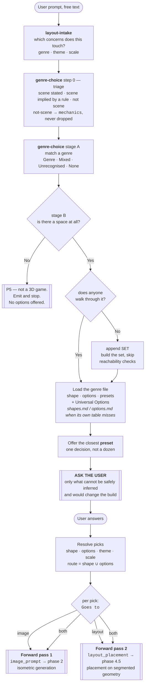
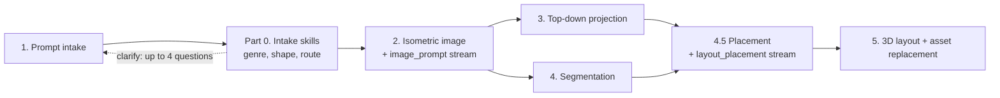
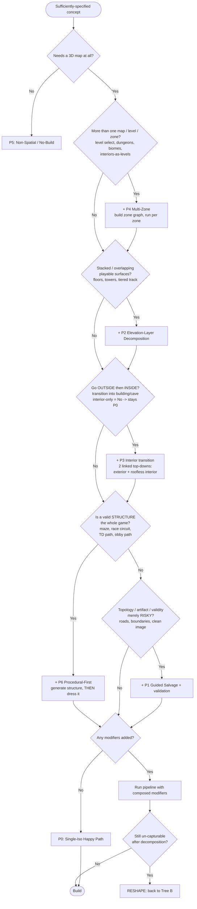

# **LayoutGen — Pipeline & Routing**

> **Design reference, not the production execution overview.** This document preserves
> the routing assumptions, failure taxonomy, and planned pipeline modifiers. For the
> current Build Agent → Cursor agent → one strict Gateway call → deterministic MapGen →
> image-to-layout workflow, use
> [`layoutgen-pipeline-overview.md`](layoutgen-pipeline-overview.md). Where the two
> documents disagree about execution or ownership, the overview is authoritative.

This document describes the **3D layout-generation pipeline** used to turn a text prompt into a playable Roblox layout, the **assumptions baked into that pipeline**, the **ways it fails**, and two **decision trees** that decide how to run it:

* **Decision Tree A — Pipeline Routing:** how to *modify* the pipeline based on the game that was prompted.
* **Decision Tree B — Prompt Sufficiency:** how to *guide the user* when their prompt is too narrow (under-specified) or asks for something the pipeline can't capture as-is.

It is a **companion** to `LayoutGen - Build.md`. That doc defines *what* a game of a given genre needs (layout options, presets, shared vocabulary). This doc defines *how* we generate the layout and *when the generation approach must change*. Wherever this doc says "genre profile," it refers to `LayoutGen - Build.md`.

**Intake is now implemented as skills**, not as prose in this document. `.cursor/skills/layout-intake/` and `.cursor/skills/genre-choice/` are the executable form of Part V's Decision Tree B and of the genre lookup in Part VI. Part 0 below describes what they hand over; where the two disagree, the skill is the live behaviour and this document is what needs updating.

---

# **Part 0 — Intake (the skills layer)**

Everything upstream of the image model is handled by two skills before the pipeline proper starts. **Intake is not a one-way transform.** It reads the prompt, decides what the game is, decides what the space needs, and then **goes back to the user** with what it could not safely infer — and only once that returns does it hand anything forward.



| Stage | Owner | What it decides |
| :---- | :---- | :---- |
| **Ingest & dispatch** | `layout-intake` | Which *concerns* the prompt touches: genre, visual theme and spatial scale. **Goal / win-condition is deliberately not a concern** — see below. |
| **Triage** | `genre-choice` step 0 | Sorts the prompt into scene stated outright, scene implied by a stated rule, and not scene. The middle pile is the one that gets missed: *"reaching the exit wins"* is a win condition and also means there is an exit. The third goes to `mechanics` intact and is **not** a coverage failure. |
| **Classify** | `genre-choice` stage A | Genre, Mixed, Unrecognised, or None. Two genres is normal and both are named, dominant first. |
| **Route** | `genre-choice` stage B | *Is there a space?* — no routes **P5** and stops. Then *does anyone walk through it?* — no appends **`SET`**. This answers Part IV's `Q0` before that tree runs. |
| **Load & offer** | `genre-choice` | Loads the genre file, offers the closest **preset** as a single decision, and adds anything the prompt asked for that the preset lacks. The genre's own tables are a shortlist, so a request they have no row for is looked up in `shapes.md` and `options.md` before it becomes free text. |
| **Ask back** | both | The clarifying round. Nothing is generated until it resolves. |
| **Forward pass** | `genre-choice` | Emits the handoff, **split into two streams** by each pick's `Goes to` tag. |

### **Asking the user — the round trip before anything is generated**

This step is not incidental: **almost every prompt leaves intake wanting to ask about something.** A prompt specific enough to need nothing is the exception, not the rule.

The budget is small and the shape of it is consistent — **four questions is the ceiling, and most prompts need two or three**, with four fields accounting for nearly all of them:

| Field | Who owns it |
| :---- | :---- |
| **scale** | `layout-intake` |
| **theme** | `layout-intake` |
| **goal / win condition** | **nobody, by decision** |
| **shape** | `genre-choice` |

**Goal is the one intake most wants to ask, and the answer is to stop asking.** Asking it does not move how often a run has a clear path to proceed — adding a `goal` field and not asking at all land in the same place. A win condition is gameplay rather than layout, and the argument that identical maps carry different win conditions is the reason not to collect it, not the reason to give it a concern.

**What survives is the spatial half, and it already has homes.** A map still needs somewhere to end, which is what F6 validates. The shape says whether the space loops or terminates, and `winner-zone` places the payoff; both are inferred from genre and preset. The one permitted question is a *shape* question — is there an end to this, or is it endless to roam — because that changes the map.

**Three rules govern the round trip:**

**Ask only what changes the build.** Anything inferable from the genre, the named reference game, or a default is filled and *recorded as an assumption* rather than asked. Part V's Decision Tree B is the full policy, and its cap is four questions including the final open "Anything else?" question.

**Ask in the user's terms, never the schema's.** "Does the player go inside buildings?" not "what is your enclosure value?" The fields above are internal names for routing, not question text.

**A preset counts as a question.** It is offered, not applied. Everything downstream assumes the user saw the preset and accepted it, so a run that silently applies one has skipped a step.

Where a route the prompt requires **is not yet buildable**, say so in the round trip rather than downgrading silently, and record the deferral in `notes`. See the readiness gate in Part IV.

### **The forward pass**

Once the round trip resolves, intake emits one JSON block and the pipeline proper starts. **It is one handoff but two destinations**, and the split is per-pick rather than per-prompt — the handoff does not give the pipeline one undifferentiated wish-list. Every option in Build.md carries a **`Goes to`** tag, and the skill splits on it:

| Stream | Meaning | Consumed by |
| :---- | :---- | :---- |
| `image_prompt` | Visible geometry — a segmenter could identify it. | **Injected into phase 2**, the isometric generation prompt. |
| `layout_placement` | Invisible or non-geometric — a trigger volume, a spawn marker, a pickup, an emitter. | **Applied at phase 4.5**, against the already-segmented layout. |

An option tagged `both` appears in both streams: the visible half is drawn, the functional half is placed. For anything free-text with no tag to look up, the skill applies the rule *if a segmenter could identify it as geometry it is `image`; if it is an invisible volume, a marker, a trigger, or a property of geometry rather than geometry itself, it is `layout`.*

This matters to the pipeline for two reasons. It is what keeps the image prompt from being saturated with things the image model cannot draw, and it is what phase 4.5 consumes as its work list.

```json
{ "genres": ["shooter"],
  "shape": { "id": "lane-network", "type": "Lane", "name": "Lane Network" },
  "preset": "Bomb Defusal",
  "pipeline": ["P0"],
  "image_prompt": [ { "id": "cover-los", "text": "Waist-high and full-body cover distributed evenly across every lane" },
                    { "id": "island-cluster", "text": "Five rocky islets ringing the harbour", "count": 5 } ],
  "layout_placement": [ { "id": "spawn-teambase", "type": "SpawnZone", "text": "Balanced bases at opposite ends" } ],
  "mechanics": ["Rounds are best of thirty", "Buy menu between rounds"],
  "notes": ["Preset shape swapped to open-battlefield: prompt described dispersed points of interest, not lanes."] }
```

**`shape` has a second form, and the pipeline must handle both.** The example above names a catalogue row. When nothing in the 45-row catalogue describes the space, the skill emits a **described shape** instead: `id`, `type` and `name` all `null`, the user's own words in `text`, and the five routing axes answered directly in `axes`. It routes off those axes exactly as the No Genre path does, so the `pipeline` array is populated the same way and nothing downstream changes.

```json
"shape": { "id": null, "type": null, "name": null,
           "text": "a single skyscraper, played floor by floor from the lobby up",
           "axes": { "axis-enclosure": "interior-only", "axis-verticality": "stacked" },
           "rejected": [ { "id": "interior-single", "why": "one enclosed space; this is forty stacked ones" } ] }
```

`axes` omits any axis left at its default, so `"axes": {}` is legal and means a plain `P0`. `rejected` records which catalogue shapes were turned down and why — the skill may not emit this form without it. **A described shape recurring with the same axis bundle is how the catalogue earns its next row**, so anything aggregating these should key on `axes` rather than `text`.

**Four more fields the pipeline should not ignore.**

`count` is optional and appears on any pick whose quantity the prompt stated — "five islands," "three floors," "about twenty houses." It exists because nothing else in the handoff can hold a number; the scale band is a four-value enum, so a stated quantity dropped here is gone. It is the number the user gave, not a normalised one.

`notes` carries what the skill decided but could not encode: a close shape call, a `CHECK` to look at, a request no option covered, a preset whose shape was substituted, and any route the prompt required that is **not yet buildable** and was therefore deferred. Anything downstream that reports back to the user should read it.

`mechanics` carries everything the prompt asked for that is not the scene — scoring, currency, rounds, progression, controls, camera, UI, audio, player and team counts. **This pipeline does not consume it and must not try to.** It exists because most prompts are largely gameplay, and intake needs somewhere to put that which is neither the layout stream nor a record of failure: a prompt three-quarters full of mechanics is served completely by a correct map, and entries here mean triage worked rather than that something was dropped. Kept apart from `notes` because the two are addressed to different readers — `notes` to this pipeline, `mechanics` to the stream that builds the game.

`genres` may hold **two entries, dominant first**, which is a normal outcome rather than an edge case. Only the dominant one's shape and genre-wide route are in force; the second is there because the pipeline and any later concern need to know what the game actually is.

**Every genre also inherits six Universal Options** — ambient population, enterable interiors, water, settlement density, terrain relief, island clusters. They arrive by ID like any other pick, and four of them carry a route (see Part VI).

---

# **Part I — The Pipeline (As-Is)**

The current pipeline is a linear, single-pass flow:

1. **Prompt intake.** The user writes free text describing their game. This ranges from a few words ("make me a game like Pac-Man," "a roller-coaster tycoon," "an infinite runner where I dodge zombies and aliens") to a full one-page design essay. **Part 0 turns this into a structured handoff**, including the pipeline route, before phase 2 runs. It is the only phase that talks back to the user, and almost every prompt gives it something to ask, so treat phase 1 as a **round trip, not a read**.
2. **Prompt → Isometric image.** The prompt plus the handoff's `image_prompt` stream is sent to an LLM/image model that generates **one isometric render of the whole game layout**.
3. **Isometric → Top-down.** The isometric image is reprojected into a single top-down plan view.
4. **Isometric → Segmentation.** The isometric image is segmented into typed components: `Path`s, `Barrier`s (walls/fences), buildings, props, terrain, etc. (using the shared vocabulary from `LayoutGen - Build.md`).
5. **Layout → 3D → Asset replacement.** The plan is reconstructed in 3D, then individual components are replaced with assets from generation services.

**Phase 4.5 — non-geometric placement.** Between segmentation and the 3D build, the handoff's `layout_placement` stream is applied against the segmented layout: spawn volumes, triggers, pickups, checkpoints, emitters. These were never in the image, so they cannot be segmented out of it — they are placed relative to the geometry that was. This phase has no failure mode in Part III because nothing about it is generative; it is bookkeeping against a layout that already exists.



---

# **Part II — Baked-In Assumptions (Where It Breaks)**

The pipeline is, in effect, a **single-surface, all-exterior, single-zone heightfield generator**. Six assumptions are hard-coded into it. Every failure in Part III is one of these assumptions being violated.

| # | Assumption | Consequence when violated |
| :---- | :---- | :---- |
| **A1** | **One image = the whole game.** There is one map, not multiple levels/zones/instances. | Games with level select, dungeons, distinct biomes, or interiors-as-levels cannot be represented. |
| **A2** | **The whole layout fits a single isometric frame.** | Large or sprawling games get cropped or compressed to fit one frame. |
| **A3** | **A single top-down projection preserves what we need to build.** | Anything that overlaps in plan view (stacked roads, bridges over tunnels) collapses into ambiguity. |
| **A4** | **The world is a single surface (a heightfield) — one surface height per (x,y).** Nothing playable **overhangs** anything else. | Towers, multi-floor buildings, spiral climbs, bridges over paths, and tunnels put two playable surfaces at the same (x,y) and lose the lower one in top-down. *(Tiered/terraced relief is fine — it's still one surface per (x,y); it just needs its elevation captured, not flattened.)* |
| **A5** | **The game stays in one enclosure state** (all-outside *or* all-inside) and never transitions. | Interior-only games are fine (generated roofless). Going **outside → inside** needs a second, linked top-down the single-pass pipeline can't produce. |
| **A6** | **The play-volume is representable over one framed surface.** | Volumetric games (flight, swim, space) are fine when the whole area fits one image over a surface (the volume is a play-height envelope). This only breaks if the volume **self-occludes** — dense 3D structure hiding what's behind it (see F7). |

---

# **Part III — Failure Taxonomy**

Every generated layout is either a **clean pass** or exhibits one or more **failure modes**. The failure modes are stable and classifiable, which is what makes routing (Part IV) possible. Examples reference the paired images in `example_images/`.

### **Clean-pass signature**

A layout passes cleanly through the current pipeline when **all** of the following hold:

* **Single elevation** — one playable surface; no gameplay stacked above other gameplay.
* **Single enclosure state** — the game is *either* all-exterior *or* all-interior, but does not transition between the two. An **interior-only** game (whole game inside a cave/building/dungeon) passes cleanly: it is generated **roofless as a single top-down**, exactly like an exterior map. Only games that go **outside → then inside** break this (see F2).
* **Single zone** — the whole experience is one contiguous map.
* **Representable play-volume** — either players move on a walkable/drivable surface, *or* they move through an open volume whose whole area is captured over one surface (flight over terrain, swim above a seafloor → the volume is just a play-height envelope). Only a **self-occluding** volume fails here (see F7).
* **Legible goal** — start/finish/objective (if any) is unambiguous from above.

Reference clean passes:

* `example_images/topdown_b.png` — zoo: flat, fenced enclosures, connected paths.
* `example_images/topdown_j.png` — maze **with** a marked start (green) and end (red).
* `example_images/topdown_d.png` — flat circular showcase platform.

### **Failure modes**

| Mode | What breaks | Assumption(s) | Examples |
| :---- | :---- | :---- | :---- |
| **F1 — Vertical occlusion (overhang)** | One playable surface **overhangs** another (shares an (x,y) at a different height), hiding the lower one in top-down. The trigger is **overhang, not elevation** — tiered/terraced relief with no overhang does **not** trip this (it's a single heightfield; flag it for elevation capture instead). | A4, A3 | `isometric_g` tower obby, `isometric_h` spiral tower, `isometric_f` cloud platformer, `isometric_a` switchback road stacking over itself |
| **F2 — Exterior→interior transition** | Going **outside → then inside** a structure. It needs **two linked top-downs** (one exterior, one roofless interior) instead of the pipeline's single top-down. *(Note: an **interior-only** game does **not** trip F2 — it's a clean pass, generated roofless as one top-down. Only the transition breaks.)* | A5 | `isometric_c` enterable bunkers, `isometric_e` cave entered from the outside |
| **F3 — Path/topology incoherence** | Roads/paths that dead-end into nothing, don't connect, or overlap illogically. | A3 | `isometric_a` switchbacks, `isometric_i` track crossing tunnels/bridges, `topdown_k` maze |
| **F4 — Multi-zone world** | The game inherently needs multiple maps/levels/zones that don't co-exist on one surface. | A1, A2 | building-entry games, level-select games, multi-biome worlds (borderline: `isometric_i` islands) |
| **F5 — Generation artifacts** | Non-diegetic junk baked into the image (UI, text, watermarks, sliders). | — | `topdown_k` (UI slider panel rendered into the map) |
| **F6 — Semantic invalidity** | The layout is unsolvable or has no legible goal (no reachable exit, no finish line, no objective). | — | `topdown_k` maze has no clear exit; any race with no finish |
| **F7 — Volumetric occlusion** *(conditional)* | Gameplay happens in a **3D volume** (flight, swimming, space). This is usually **fine** — if the whole area is captured over a representable surface (fly over terrain, swim above a seafloor), the surface generates normally and the volume is a **play-height envelope**. It only breaks when the volume **self-occludes** (asteroid fields, layered floating islands, 3D cave networks), which collapses to an F1/verticality problem. | A6 (only when occluding) | *fine:* flight over terrain, underwater over a seafloor · *breaks:* dense asteroid field, 3D cave network |

> **Note:** Failure modes **compose.** A multi-floor building you can enter inside a level-select game triggers F1 + F2 + F4 simultaneously. The router (Part IV) therefore accumulates *modifiers* rather than picking a single bucket. F7 is a **check, not an automatic break** — an open volume over a framed surface passes as P0 (plus a play-height envelope); only a self-occluding volume routes to **P2** (see Attribute → Response below).

---

# **Part IV — Decision Tree A: Pipeline Routing / Modification**

**Goal:** given a sufficiently-specified game concept (see Part V), decide *how to run the pipeline*. The router does not pick one of N mutually-exclusive pipelines; it starts from the happy path and **accumulates modifiers**, because failure modes compose.

### **Attribute → Response (the bridge from Build)**

The **five routing axes** defined in `LayoutGen - Build.md` are the router's inputs: a game's non-default value on any axis maps directly to a modifier (or a gap) below. This is how a description of the space becomes a pipeline decision.

| Attribute | Default (supported) | Deviation | Pipeline response |
| :---- | :---- | :---- | :---- |
| **Enclosure** | `exterior` → **P0** | `interior-only` | **P0** — generated roofless as one top-down (supported, no modifier) |
| | | `transition` (outside↔inside) | **P3** — two linked top-downs |
| **Verticality** | `single-surface` → **P0** | `tiered` · `stacked` | `tiered` (relief, no overhang) → **P0 + elevation-capture flag** (orange — supported, but capture the height or it builds flat). `stacked` (overhang) → **P2** elevation-layer decomposition. |
| **Zone count** | `single` → **P0** | `multi-zone` | **P4** — per-zone passes |
| **Structure-criticality** | `dressed` → **P0** | `must-be-valid` | **P6** — procedural-first inversion (variant, same tools) |
| **Play-space dimensionality** | `grounded-surface` → **P0** | `volumetric` | **CHECK (F7).** Open volume over a framed surface → **P0** + a play-height envelope (supported). Self-occluding volume → **P2**. Area too large to frame → scale (P4-adjacent). |

**Reading it:** all defaults → P0 (happy path). Each deviation adds its modifier. `interior-only` is a deviation that is *already supported* (still P0). `must-be-valid` (P6) and `tiered` (elevation-capture flag) are supported **orange** cases — not the pure happy path, but no new pipeline needed. `volumetric` is a **check**: usually fine (P0 + play-height envelope), only breaking to **P2** when the volume self-occludes. `stacked`, `transition`, and `multi-zone` are the deviations that reliably **break** the current pipeline.

### **Pipeline modifiers (the outputs)**

| ID | Modifier | Triggered by | What it changes |
| :---- | :---- | :---- | :---- |
| **P0** | **Single-Iso Happy Path** | Clean-pass signature (Part III) | Run the pipeline unchanged. |
| **P1** | **Guided Salvage (constraint injection + validation)** | F3, F5, F6 risk | Inject explicit constraints into the generation prompt ("roads form a connected network," "exactly one reachable exit," "no UI/text/overlays"), then run a **validation pass** on the output (connectivity check, solvability check, artifact scrub) before proceeding. |
| **P2** | **Elevation-Layer Decomposition** | F1 (stacked surfaces) | Replace the single top-down with a **stack of per-elevation top-down slices** plus a **vertical connectivity graph** (stairs/ladders/ramps/teleports linking layers). Segment per layer. |
| **P3** | **Interior Transition — Dual Top-down** | F2 (**outside → inside** transition only) | Generate **two linked top-downs**: the exterior map, and a **roofless interior top-down** for each enterable structure, joined by a door/entry link. Each interior top-down runs the ordinary pipeline (an interior is just a roofless single surface), so this is effectively P4 applied to interiors. *(Interior-**only** games do not need P3 at all — they are a single roofless top-down and route as P0.)* |
| **P4** | **Multi-Zone / Per-Zone Passes** | F4 (multiple maps/levels) | Decompose the game into a **zone graph** (levels, biomes, dungeons, interiors-as-zones). Run the pipeline once per zone; wire zones together with `Teleporter`s / transitions. |
| **P6** | **Procedural-First (Structure-First Inversion)** | F3 / F6 where **structural validity *is* the game** (maze, race circuit, TD path, obby path) | **Invert the pipeline.** Instead of trusting an image to define structure, generate the structural plan with a **procedural/parametric generator** that is valid by construction (solvable maze, connected circuit, single-path TD lane). That plan becomes the **top-down ground truth**. Image models are demoted from *defining* structure to *dressing* it: optionally render an isometric **from the plan** purely as visual inspiration, then generate/segment the **supporting layer** (walls, props, set dressing, buildings, terrain). See the detailed flow below. |
| **P5** | **Non-Spatial / No-Build** | Prompt is not a 3D game at all — a chat-only quiz, a 2D screen game, a bare music player with no room | Skip layout generation; route out or produce a minimal shell. **Narrow.** A space nobody walks through is `SET`, not P5. |
| **`SET`** | **Set, No Locomotion** | Real geometry that no avatar ever crosses — a floating board game, a chess table, an idle screen, a gallery shooter on rails | Build normally. **Skip traversal segmentation, path connectivity, and jump-gap validation** — nothing has to be reachable. Frame the camera on the whole set rather than over a spawn. Combines with any route: `["P0", "SET"]`, `["P3", "SET"]`. |
| **RESHAPE** | **Reject & reshape** | Concept fundamentally can't be captured even after decomposition | Return to Decision Tree B to reshape the prompt with the user. |

**Readiness: P0 and P6 are built and running. P2, P3, P4 and `CHECK` are not production-ready yet.** So a modifier is not a slower build of the same game, it is one that cannot be delivered today, and intake treats it accordingly — **when nothing in the prompt requires a modifier, the route that stays on P0 or P6 wins.** `SET` is exempt; it only removes validation from a P0 build.

**Most builds already route entirely on the proven pipeline**, and most modifiers that do appear are required by something the prompt says rather than inherited from a default — so this rule moves few builds. Two guards, both in Build.md's *Pipeline costs*: it steers judgements about scale and structure, never the presence of a feature the game obviously has (interiors are the common trap — "houses you sleep in" needs `P3` without saying so), and the deferral is always stated to the user rather than applied silently.

> **Support status — designed versus running.** **P2** (elevation), **P4** (multi-zone) and **P6** (procedural-first) are all *designable* phases: none needs a capability the pipeline cannot have. Only **P6** is running today. See the readiness gate later in this Part for what can actually be delivered, and prefer P0 or P6 whenever the prompt does not require otherwise. **Interior-only games are fully supported** — they are generated **roofless as a single top-down** and route as P0 (no special handling). **P3** covers only the harder **outside → inside transition**, which needs a **second, linked top-down** for the interior; this is a genuine deviation from the single-top-down current pipeline (a P4-style extra pass), not an impossible capability. The remaining open question is only how the exterior and interior top-downs are *linked* (door registration), not whether the interior can be generated.

### **The routing tree**



### **Reading the tree**

* **`Q0` is already answered before the tree runs.** The non-spatial cutoff lives in `genre-choice` stage B (Part 0), and it is **two** questions rather than one: *is there a space at all?* — no means `pipeline: ["P5"]` with no options offered — and then *does anyone walk through it?* — no means the build proceeds normally with `SET` appended. The node stays in the diagram because the tree should remain readable standalone, but in practice a concept reaching Tree A has passed it, `SET` included.
* **A `SET` still runs the whole tree.** It can be tiered, have interiors, or be several boards; the flag suppresses reachability checking, not routing.
* **`Q1`–`Q3` are usually answered by the shape, not asked.** The shape the user picked in Part 0 carries its own modifiers (Part VI), so the tree's job shifts from interrogating to verifying — confirming the prompt does not contradict the shape it was routed to.
* Order matters: **zones → elevation → interiors → topology**. Zone decomposition (P4) runs first because each resulting zone is then independently evaluated for stacking, interiors, and topology risk (the tree effectively recurses per zone).
* The default is P0. Modifiers are only added when a question is answered "yes."
* **P6 vs P1 is the key topology fork.** Ask "is a *valid structure* the whole game?" If yes (maze, race circuit, TD path, obby path), the image can't be trusted to produce a valid structure — go **P6 (procedural-first)** and let images only dress it. If the structure is merely *risky* but image-first is fine (e.g. roleplay road networks, adventure trails), go **P1 (salvage + validate)**. P6 replaces the image-as-source-of-truth; P1 keeps it and corrects it.
* **P3 is about the transition, not the interior itself.** Interior-**only** games skip P3 entirely — they're a single roofless top-down (P0). Q2 is "yes" only when the game goes **outside → inside**, which needs a second, linked top-down for the interior (a P4-style extra pass).
* `RESHAPE` is a last resort — reached only when even a decomposed representation can't hold the concept. In practice nearly every game becomes buildable once **P2**, **P3**, **P4**, and **P6** are composed.

### **P6 — Procedural-First flow (the inversion)**

The default pipeline is **image-first**: `prompt → isometric → top-down → segmentation → 3D`. For structure-defined genres this is backwards — the image invents a maze with no exit (`topdown_k`) or a race track that crosses itself illogically (`isometric_i`). P6 flips the first half so structure is **correct by construction** and images are used only for look:

```mermaid
flowchart LR
    A[Prompt] --> B[Extract generator params<br/>maze size, track length/laps,<br/>TD path complexity, obby spacing]
    B --> C[Procedural / parametric generator<br/>-> STRUCTURAL PLAN<br/>valid by construction]
    C --> D[Top-down plan = GROUND TRUTH]
    D --> E[(Optional) render isometric<br/>FROM the plan<br/>= visual inspiration only]
    D --> F[Generate + segment SUPPORTING layer<br/>walls, props, set dressing,<br/>buildings, terrain]
    E --> F
    F --> G[3D build + asset replacement]
```

Key differences from the image-first flow:

* The **procedural generator owns validity** — solvable maze, connected circuit, single continuous TD lane, physics-legal obby spacing (per Part I metrics in the Build doc). This eliminates F3 and F6 for these genres by construction, not by after-the-fact validation.
* The **isometric/top-down images are demoted to inspiration** — they influence theme, prop density, and set dressing, never the walkable structure.
* P6 **composes with the others**: a multi-floor procedural tower is P6 + P2; a race track that dives from the open course into an interior cave is P6 + P3 (a second roofless top-down for the cave).

---

# **Part V — Decision Tree B: Prompt Sufficiency / Guidance**

**Goal:** decide whether a prompt has enough information to route (Tree A) and build, and if not, either **infer a safe default**, **ask a high-leverage question**, or **reshape** the request. The guiding principle: **prefer inference over interrogation.** Only ask when a missing field is (a) required for a valid build *and* (b) not safely inferable from genre/reference *and* (c) materially changes the Tree A route.

> **This tree is executed by the intake skills** (Part 0), not by a human reading this section. What follows is the specification they implement; the **Owner** column below says which one holds each field. Where the two disagree, the skill is the live behaviour and this document is the thing that needs updating.

### **Required spatial fields**

| Field | Needed for | Default source when missing | Owner |
| :---- | :---- | :---- | :---- |
| **Genre / reference game** | Loads the genre's shape, options, and presets | **Not blocking.** A prompt with no discernible genre routes to the `no-genre` path, which asks the routing axes directly and builds. | `genre-choice` stage A |
| **Zone structure** (one map vs many) | Tree A · P4 | Carried by the chosen **shape**, which is a pick-one per genre | `genre-choice` |
| **Verticality** (flat / hills / floors / tower) | Tree A · P2 | Carried by the chosen **shape** | `genre-choice` |
| **Interior transition** (go outside→inside?) | Tree A · P3 (2 top-downs) | Carried by the shape or by an option tagged `P3`; interior-only = no P3 | `genre-choice` |
| **Goal / win-or-loop condition** | F6 validity; Tree A · P1 | Inferred from genre (race=finish, obby=top, maze=exit) | **Unassigned** — see below |
| **Spatial scale & boundary** | Framing (A2) | Band inferred from the prompt against the 16 studs/sec walk baseline | `layout-intake` |
| **Theme** | Asset/prop selection | Themes list in Build doc; emitted `null` rather than guessed when the prompt is silent | `layout-intake` |

**Goal / win-or-loop condition is inferred, never asked.** F6 (semantic invalidity) needs the map to have somewhere to end, and that part is spatial: the shape says whether the space loops or terminates, `winner-zone` places the payoff, and both follow from genre and preset — a race ends at a finish, an obby at the top, a maze at an exit. The condition *itself* — first to three points, defuse the bomb — is gameplay and has no layout consequence, so no field carries it and neither skill collects it.

**Question caps.** This section says "cap at 3 questions," and Part 0 agrees: two or three is what the work needs. **Three is the ceiling, not the target.**

The skills phrase their caps per step rather than per prompt — one clarifying question at classification and only when the genre is Unrecognised, roughly five items on screen when tuning, one open question at the end. Those are limits on each exchange; **the three-question cap here is the limit on the whole round trip**, and it is the one to hold to. Do not read it as "usually one" — two is the common case and one is rare.

### **The sufficiency tree**

```mermaid
flowchart TD
    START([Raw prompt]) --> G{Genre or reference<br/>game identifiable?}
    G -- No --> ASKG[[ASK: "What kind of game?"<br/>or "A game like ___?"<br/>the one truly blocking gap]]
    ASKG --> G
    G -- Yes --> LOAD[Load genre profile:<br/>Hard Needs + defaults<br/>from Build doc]

    LOAD --> FILL[Auto-fill non-routing fields:<br/>scale, boundary, theme<br/>never ask, use defaults]
    FILL --> LOOP{For each routing-critical field:<br/>zones, verticality,<br/>interiors, goal}

    LOOP --> INFER{Stated OR safely<br/>inferable from<br/>genre/reference?}
    INFER -- Yes --> SETDEF[Set value / default<br/>note assumption]
    INFER -- No, and it<br/>changes the route --> QUEUE[Queue clarifying question]
    SETDEF --> LOOP
    QUEUE --> LOOP

    LOOP -- done --> CONFLICT{Prompt conflicts with<br/>pipeline limits?<br/>e.g. "100-floor tower<br/>in one top-down"}
    CONFLICT -- Yes --> RESHAPE[[RESHAPE: explain limit,<br/>offer decomposed alternative]]
    CONFLICT -- No --> COUNT{Any queued<br/>questions?}
    COUNT -- Yes --> ASK[[ASK up to 3,<br/>highest-leverage first]]
    COUNT -- No --> READY([Proceed to Decision Tree A])
    ASK --> READY
    RESHAPE --> READY
```

### **Three responses to an under-specified prompt**

1. **Infer (default path).** Fill from the genre profile and *record the assumption* so the user can correct it. Example: "make me a Pac-Man game" → genre = maze/arcade → single zone, flat, no interiors, goal = clear all pellets + reachable layout. No questions needed.
2. **Ask (only when it flips the route).** Reserve questions for the handful of answers that change which modifiers Tree A adds. The three highest-leverage questions are almost always:
   * "Is this **one map**, or **multiple levels/areas**?" (→ P4)
   * "Does the game **move between outside and inside**, or stay entirely in one (all-outdoors *or* all-indoors)?" (→ P3 only for the transition; interior-only stays P0)
   * "Is it **flat/hilly**, or does it **stack upward** (floors/tower)?" (→ P2)
   Cap at **3 questions**; never interrogate.
3. **Reshape (over-narrow / contradictory).** When the prompt demands something the pipeline can't honor as literally stated (e.g., a tall tower "seen in one top-down image"), explain the limitation briefly and offer the decomposed alternative the pipeline *can* build (e.g., per-floor slices with a connectivity graph).

---

# **Part VI — Shape → Pipeline Route**

**Keyed on shape, and there is exactly one table to key on.** Build.md's **Shape Catalog** holds every shape in the system and **every one is reachable from every genre**, so this is a flat lookup rather than a per-genre grid. A genre may reword a shape; it cannot re-route one. That is why the route lives in the catalogue and is restated here once.

One row per shape, so a shape cannot disagree with itself across genres. 45 shapes, 45 rows, no duplicates.

Read a build's route as **genre route ∪ shape route ∪ every picked option's route.**

| Shape | Route | Note |
| :---- | :---- | :---- |
| `space-bounded` | P0 | One bounded, single-level space. Arena, court, lobby and round map alike. |
| `rooms-sequence` | P0 | **Interior-only, and that is not P3.** A sealed run of rooms is one roofless top-down; only an outside↔inside *transition* earns P3. |
| `world-open` | P0 | One contiguous surface, nothing instanced. |
| `route-guided` | P0 | Directed, but still one continuous space. |
| `puzzle-open` | P0 |  |
| `settlement-static` | P0 |  |
| `wilderness-open` | P0 |  |
| `stage-runway` | P0 |  |
| `lane-network` | P0 |  |
| `open-battlefield` | P0 |  |
| `range-directed` | P0 |  |
| `plot-isolated` | P0 |  |
| `plot-shared` | P0 |  |
| `tier-ladder` | P0 | Walled-off tiers still share one surface. |
| `terrain-open` | P0 |  |
| `venue-stage` | P0 | Every sightline faces the stage; nobody routes *through* it. |
| `interior-single` | P0 | **Interior-only is P0, not P3.** One enclosed space is a single roofless top-down; P3 is for an outside↔inside *transition*, and there is no outside here. |
| `vehicle-deck` | P0 | A bounded surface like any other. That it is moving is not a layout property. |
| `arena-tiered` | P0 + tiered | Relief with nothing overhanging. The height must be captured or it builds flat. |
| `settlement-claimable` | **P3** | **Only if the interiors are real.** A claimable house nobody enters is P0. |
| `settlement-buildable` | **P3** | **Only if the interiors are real.** |
| `arena-stacked` | **P2** | Surfaces overhang: per-elevation slices plus a vertical connectivity graph. |
| `traversal-city` | **P2** | Rooftops over streets is overhang by definition, and both levels are played on. |
| `set-display` | `SET` | Real geometry that nobody crosses. Build and light it; skip traversal segmentation and reachability, because there is no route to check. Stage B reaches the same verdict from the other direction. |
| `world-underground` | **P2 + P3** | The layers overhang and the descent is a transition. |
| `world-chaptered` | **P4** | **A default, not a fact** — if the prompt says one continuous map, keep the shape and route P0. |
| `space-staged` | **P4** | **A default, not a fact.** The stage has to be genuinely unseeable from the lobby to earn P4. |
| `world-open-biomes` | **P4** | **A default, not a fact.** Graded biomes on one map are P0. |
| `world-biomes` | **P4** | **A default, not a fact.** Same reasoning as `world-open-biomes`. |
| `hub-portals` | **P4** | **A default, not a fact.** P4 only when the destinations are actually built. |
| `world-hub-dungeon` | **P4 + P3** | Separate instances *and* interiors. |
| `course-flat` | **P6** | Physics-legal spacing *is* the game. |
| `puzzle-maze` | **P6** | Solvability *is* the game. |
| `lane-actor-track` | **P6** | One continuous, unambiguous lane *is* the game. |
| `warren-looping` | **P6** | Zero dead ends *is* the game. |
| `route-point-to-point` | **P6** | A connected course *is* the game. |
| `route-circuit` | **P6** | A closed loop *is* the game. |
| `lane-snap` | **P6** | Chunk spacing *is* the game. |
| `lane-free` | **P6** | Chunk spacing *is* the game. |
| `interior-endless` | **P6** | Extent is generated rather than authored, so the corridor graph must be valid by construction. |
| `course-terraced` | **P6 + tiered** |  |
| `course-tower` | **P6 + P2** | Platforms sit directly above each other. |
| `route-multitier` | **P6 + P2** | Sections cross above and below other sections of the same course. |
| `volume-open-air` | `CHECK` | Flight over a representable surface is fine as a play-height envelope; layered rooftops that self-occlude are not. |
| `board-grid` | **SET** | There is a set and it must be built, but **nobody walks on it**, so traversal and jump-gap validation are skipped. |

### **Genre-wide routes**

Three genres force a route whatever shape is picked, because structural validity is the game rather than a property of the space:

| Genre | Route |
| :---- | :---- |
| **Obby & Platformer** | **P6** |
| **Racing** | **P6** |
| **Infinite Runner** | **P6** |

This composes with the shape: `space-bounded` is P0 on its own and **P6** in Obby & Platformer.

### **No Genre answers the axes instead**

A prompt naming no game type loads `no-genre.md`, which has no genre prior to infer a shape from and so asks the five routing axes directly: `axis-enclosure` **P3** *(transition only)* · `axis-verticality` tiered / **P2** · `axis-zone-count` **P4** · `axis-structure` **P6** · `axis-play-space` `CHECK`. **Every axis defaults to the cheap answer** — exterior, single-surface, single zone, dressed, grounded — so the default is P0 and only a stated non-default costs anything. This is the right outcome often enough to be a live path rather than a fallback.

Read the axes as the decomposition behind the table above: every shape is a named bundle of these five answers plus a description of the space. That is also why the catalogue is not generated *from* the axes — many shapes share the all-defaults bundle, and what separates them is entirely their description.

### **Options add a route to any genre**

**Every option is reachable from every genre, exactly as every shape is** — a genre's table is its shortlist and its wording, not the limit of what it can offer. So an option's route cannot be filed per-genre either, and **any of the twenty-one route-carrying options can land its route on any of the fifteen genres.**

Seventeen of those are filed under a genre but reachable from all of them: `teleporter-link` **P4**; `path-flank-tunnel` **P2**; `backstage-support` and `reveal-exit` **P3**; `chunk-modular`, `lane-corridor`, `obstacle-maze`, `path-road-vehicle`, `path-track`, `startpoint-line` and `trigger-finish` **P6**; `buildzone-plateau`, `cover-elevated`, `spectator-bleachers`, `spectator-zone` and `terrain-tiered` `P0 + tiered`; `volume-open` `CHECK`.

**This widens the readiness gate rather than the catalogue.** `CHECK`, P2, P3 and P4 are not production-ready, and a Puzzle or Sports build that previously had no way to reach them now does. The gate is unchanged — prefer the route that stays on P0 or P6, state the deferral rather than downgrading silently — but it now has to be applied to options a genre does not list.

Three of the seventeen route differently depending on what the prompt meant rather than which ID it is, and `options.md` marks them *varies*: `spectator-zone` is `P0 + tiered` as raked stands and P0 as a dugout, `teleporter-link` is `P4` as a portal to a separate place and P0 as fast travel inside one map, and `path-road-vehicle` is `P6` where the road *is* the course and P0 where it is a street.

The remaining four are the **Universal Options**, inherited by every genre outright:

| Option | Route | Note |
| :---- | :---- | :---- |
| `building-interior` | **P3** | Play moves outside↔inside. Four genres word it themselves; the route is the same. |
| `terrain-relief` | `P0 + tiered` | Hills, cliffs, valleys — relief with no overhang. **Caves, overhangs and tunnels push it to `P2`.** |
| `water-body` | `CHECK` | Swimming is volumetric: fine as a play-height envelope over a representable surface, a problem only when the volume self-occludes. |
| `island-cluster` | `CHECK` | Same reasoning, for flight and boat crossings between landmasses. |

The other two — `npc-population` and `settlement-density` — are P0. Because options reach everywhere, **a route can arrive on a genre whose own shapes are all P0**; a flat arena shooter with a lake is `CHECK`, and nothing in the per-genre row above predicts it.

> **Reminder:** a **P3** means an **outside→inside transition** (2 linked top-downs). Interior-**only** games are *not* P3 — they route as P0 (single roofless top-down). Note that `rooms-sequence` is P0 for exactly this reason: a sealed run of rooms is interior-only.

**The `P4` entries in this table are defaults, not facts.** A shape describes the space and routes the build in a single pick, so a prompt that wants graded biomes on **one continuous map** would otherwise be split into separate maps by `world-biomes`. When the prompt says one map outright, the shape stands and the route drops to P0; see *The route in a shape row is sometimes a default* in Build.md for the full rule and the shapes it covers. **`P6` is never a default** — structural validity is the game, and an image model cannot guarantee it. This fires rarely: it is a correction for an explicit contradiction, not a licence to re-derive routes the prompt never mentioned.

**Two routes that are easy to get wrong.** Sports is **P0** — there is no `P6-lite` modifier and a template field is not one. Infinite Runner is **P6** and is never P5-adjacent: a runner has a very real 3D map.

---

# **Part VII — Intake Triage: Phase Compatibility & Variation Failures**

Run this **at intake, before generating anything**. Its job is to answer one question: *will this game work in the current image-first pipeline, and if not, which phase breaks, why, and what modifier fixes it?* Part VI gives the genre prior; this Part gives the phase-level detail and the specific variations that fail.

### **Phase vulnerability reference**

Each pipeline phase (Part I) fails for a specific reason. Triage is really "which of these does this game trip?"

| Phase | What it assumes | What breaks it (failure mode) | Genres / variations affected | Fix |
| :---- | :---- | :---- | :---- | :---- |
| **2 · Single isometric of the whole game** | One frame holds the entire experience (A1, A2) | **F4** multi-zone; oversized open worlds | Level-select, dungeons, multi-biome RPG/Adventure, Party lobby+stage, Hub | **P4** |
| **2 · Image *defines* structure** | A drawn layout is structurally valid | **F3 / F6** invalid structure | Maze, race circuit, TD path, obby path | **P6** |
| **3 · Top-down projection** | One surface per (x,y); nothing **overhangs** (A4) | **F1** overhang / occlusion | Obby tower & spiral, multi-floor buildings, switchback mountain roads, multi-tier track *(tiered relief with no overhang is fine — flag for elevation capture, not P2)* | **P2** |
| **2/3 · Second top-down** | The game stays in one enclosure state (A5) | **F2** outside→inside transition | Enter houses (Brookhaven), overworld→cave, compound raid, surface→underground *(interior-**only** games do NOT trip this — they're roofless P0)* | **P3** (2 linked top-downs) |
| **4 · Segmentation** | The image is clean/diegetic | **F5** baked-in artifacts | Any model prone to UI/text/watermark leakage (`topdown_k`) | **P1** artifact scrub |
| **5 · 3D build** | The layout is playable/solvable | **F6** no goal / unsolvable | Maze w/o exit, race w/o finish | **P6** (valid by construction) or **P1** validation |
| **3 · Top-down represents the volume** | Play-volume fits over one framed surface (A6) | **F7** self-occluding volume | *fine:* flight over terrain, underwater over seafloor · *breaks:* asteroid field, 3D cave network | **CHECK** → P0 + play-height envelope, or **P2** if occluding |

**Every row above assumes an avatar moves through the result. Some games have no such avatar.** A board on a table, an idle screen, a rhythm stage, a gallery shooter on rails — real geometry that nobody walks on. Those carry **`SET`**, and it is the one flag that *removes* work: phases 2 through 5 run as normal, but traversal segmentation, path connectivity, and jump-gap validation are skipped, because nothing has to be reachable. It therefore cannot trip **F3** or **F6** — an unsolvable maze is not a defect in a maze nobody walks. Frame the camera on the whole set rather than over a spawn point, since there is no spawn point.

**Readiness gate before acting on any of this.** P0 and P6 are built and running; **P2, P3, P4 and `CHECK` are not production-ready.** So a modifier is not a slower build of the same game, it is one that cannot be delivered today. Intake therefore prefers the route that stays on P0 or P6 whenever nothing in the prompt requires otherwise, states the deferral to the user rather than downgrading silently, and records it in `notes`. Most builds are already there, so **this settles ties rather than filtering work.** The guard is that it steers judgements about *scale and structure* — one map or several, does anything overhang — and never the presence of a feature the game obviously has. **Interiors are the trap:** "houses you sleep in" and "shops you buy from" both require `P3` without using the word.

**Two further guards on that preference.**

**Never push away from P6.** It is a readiness rule, not a cost rule, and P6 is
proven. An obby stays P6. Only move off it when the structure genuinely does not
need to be valid by construction.

**Never downgrade silently.** Say what was built and offer the upgrade in plain
language, so an invisible assumption becomes a choice the user can correct:

> Building this as one continuous map. Separate zones per biome is possible but
> isn't ready yet — say the word and I'll note it for when it is.

**`SET` is not `P5`, and the two are told apart by two questions in order.** P5
skips layout generation entirely, which refuses to build something perfectly
buildable, and genuinely non-3D prompts are rare — so a P5 that fires on "nobody
walks here" is wrong far more often than right.

| | Is there geometry? | Does anyone walk on it? |
| :---- | :---- | :---- |
| **P0 and the rest** | Yes | Yes |
| `SET` | Yes | **No** |
| **P5** | **No** | No |

Ask *is there a space?* before *does the player move?* Yes then no is `SET`;
only no to the first is `P5`. What is left for P5 is the genuinely non-spatial:
a chat-only quiz, a 2D screen game, a music player with no room around it.

### **Variation failure matrix**

Verdict legend: ✅ **Fits current pipeline (P0)** — incl. interior-only (roofless) and open-volume play (P0 + play-height envelope) · ◆ **Orange — supported, not the pure happy path**: P6 variant (reordered, same tools) *or* a **tiered elevation-capture flag** (relief with no overhang) · ✕ **Breaks — new path** (P2 overhang / P3 outside→inside / P4 multi-zone). Volumetric play is a **check**: ✅ when the volume fits over one framed surface, ✕ (→P2) when it self-occludes. This matches the `pipeline-viewer.html` color coding (green / orange / red).

**`SET` is a fourth verdict and it is green.** A space nobody walks through — a board on a table, an idle screen, a gallery shooter on rails — builds on the current pipeline and then **skips** the checks that exist to serve a moving avatar: traversal segmentation, path connectivity, and jump-gap validation. It is the only verdict that makes the pipeline do *less*, so it never breaks anything. It composes with the rest: a `SET` can still be tiered or have interiors.

| Genre · Variation | Verdict | Breaking phase → failure | Route / fix |
| :---- | :---- | :---- | :---- |
| **Action** — flat arena | ✅ | — | P0 |
| **Action** — tiered stadium arena (relief, no overhang) | ◆ | 3 (elevation) | P0 + tiered flag (capture height) |
| **Action** — multi-tier arena (floors overhang) | ✕ | 3→F1 | P2 |
| **Adventure** — single-level linear trail | ✅ | — | P0 |
| **Adventure** — cave-only exploration (interior-only) | ✅ | — | P0 (roofless top-down) |
| **Adventure** — overworld → enter caves | ✕ | 2→F4, 2/3→F2 | P4 + P3 |
| **Obby** — flat difficulty-chart / vehicle | ◆ | 2→F3/F6 | **P6** (physics-legal spacing is the game) |
| **Obby** — terraced / amphitheater (relief, no overhang) | ◆ | 2→F3/F6, 3 (elevation) | P6 + tiered flag (capture height) |
| **Obby** — tower / spiral (surfaces overhang) | ✕ | 2→F3/F6, 3→F1 | P6 + P2 |
| **Party & Casual** — single flat minigame arena | ✅ | — | P0 |
| **Party & Casual** — lobby + stage | ✕ | 2→F4 | P4 |
| **Party & Casual** — hide-and-seek maze | ◆ | 2→F3/F6 | P6 |
| **Puzzle** — open flat plaza | ✅ | — | P0 |
| **Puzzle** — escape room (interior-only) | ✅ | — | P0 (roofless top-down) |
| **Puzzle** — maze | ◆ | 2→F3/F6, 5→F6 | P6 |
| **RPG** — single-map (no dungeons/interiors) | ✅ | — | P0 |
| **RPG** — dungeon-crawler (interior-only) | ✅ | — | P0 (roofless top-down) |
| **RPG** — hub + enter dungeons | ✕ | 2→F4, 2/3→F2 | P4 + P3 |
| **Roleplay & Avatar Sim** — static town (exteriors only) | ✅ | — | P0 |
| **Roleplay & Avatar Sim** — enter houses (Brookhaven) | ✕ | 2/3→F2 | P3 |
| **Shooter** — arcade flat / indoor-only | ✅ | — | P0 |
| **Shooter** — aim-training range (firing line, targets downrange) | ✅ | — | P0 |
| **Shooter** — rail or gallery shooter (targets, camera on rails) | ✅ | — | P0 + **`SET`** |
| **Shooter** — multi-floor arena | ✕ | 3→F1 | P2 |
| **Shooter** — compound raid (outside→breach) | ✕ | 2/3→F2 | P3 |
| **Simulation** — flat tycoon plots / single open map | ✅ | — | P0 |
| **Simulation** — stat ladder ("+1 speed" tiers behind gates) | ✅ | — | P0 |
| **Simulation** — mining tycoon (surface→underground) | ✕ | 3→F1, 2/3→F2 | P2 + P3 |
| **Simulation** — idle clicker (a set you watch, nobody walks) | ✅ | — | P0 + **`SET`** |
| **Strategy** — RTS (open terrain) | ✅ | — | P0 |
| **Strategy** — Tower Defense (Actor Track) | ◆ | 2→F3 | P6 |
| **Strategy** — board or card game (a table nobody walks on) | ✅ | — | P0 + **`SET`** |
| **Survival** — flat map w/ hiding props | ✅ | — | P0 |
| **Survival** — indoor mascot-horror (interior-only) | ✅ | — | P0 (roofless top-down) |
| **Survival** — looping "zero dead-end" map | ◆ | 2→F3 | P6 |
| **Survival** — flee outside → hide in buildings | ✕ | 2/3→F2 | P3 |
| **Sports** — regulation field | ✅ | — | P0 |
| **Racing** — simple flat circuit | ◆ | 2→F3/F6 | P6 |
| **Racing** — multi-tier track w/ tunnels | ✕ (+◆) | 2→F3/F6, 3→F1 | P6 + P2 |
| **Infinite Runner** — procedural auto-runner | ◆ | (procedural) | P6 |
| **Entertainment** — Showcase / interior walkthrough | ✅ | — | P0 |
| **Entertainment** — performance venue (stage + audience floor) | ✅ | — | P0 *(tiered if the seating is raked)* |
| **Entertainment** — Hub (portals out) | ✕ | 2→F4 | P4 |
| **(No Genre)** — a described place, all axes at default | ✅ | — | P0 |
| **Racing** — flight circuit over terrain (open volume) | ✅ | — | P0 + play-height envelope |
| **Adventure** — underwater exploration over a seafloor (open volume) | ✅ | — | P0 + play-height envelope |
| **Shooter** — space dogfight in a dense asteroid field (self-occluding volume) | ✕ | 3→F7/F1 | P2 (occlusion) |

### **Using the triage at intake**

1. Identify genre + variation (Decision Tree B first if the prompt is too narrow to know).
2. Look up the row above to get the **verdict** and **likely modifiers** (a prior).
3. Confirm the prior with Decision Tree A's four questions (zones → elevation → interiors → topology) — the prompt can override the genre default.
4. **Act on the verdict:**
   * ✅ → build with the current pipeline (an interior-only game is one **roofless top-down**).
   * ◆ → run the **P6 variant** (generate structure procedurally first, images dress it).
   * ✕ → compose the breaking modifier(s): **P2** (elevation), **P3** (exterior + roofless-interior top-downs), **P4** (zone graph). These are **not built yet**, so confirm the prompt truly requires one before composing it, and say so if it defers the build. `RESHAPE` only if even these can't hold it.
   * **`SET`** → build as ✅, then skip traversal segmentation, path connectivity and jump-gap validation, and frame the camera on the whole set.

* **P2 layer granularity:** per *floor* vs per *elevation band*? Floors are cleaner for buildings/towers; bands are better for continuous terrain like `isometric_a`. May need both.
* **P4 zone-graph authoring:** who defines the zone graph — the LLM from the prompt, or a fixed genre template? Likely LLM-proposed, template-validated.
* **P1 validation depth:** minimum viable checks are (1) path/graph connectivity, (2) goal reachability, (3) artifact scrub. Deeper playability checks (difficulty, fairness) are out of scope here.
* **P6 generator inventory:** which procedural/parametric generators do we own or need — maze, race circuit, TD lane, obby path, chunk stream? Each genre-critical structure needs one.
* **P6 inspiration feedback loop:** how strongly does the "isometric-from-plan" inspiration image feed back into set dressing/theme without ever perturbing the locked structure? Define the one-way boundary (plan → image, never image → plan).
* **P6 vs P1 boundary:** some genres (roleplay road networks, adventure trails) are borderline — the path matters but isn't the whole game. Decide the cutoff for "structure IS the game" (P6) vs "structure is risky" (P1).
* **P3 door/link registration:** how are the exterior and interior top-downs joined — a shared door marker present in both, a portal/`Teleporter`, or a stitched seam? Define the link contract so the two passes reconcile at the entrance.
* **P3 vs P4 boundary:** an interior top-down is effectively a P4 zone. Decide when an interior is modeled as its own **zone (P4)** vs an attached **interior top-down (P3)**, so the same space isn't double-modeled.
* **Borderline single-vs-multi zone:** `isometric_i` (racing islands) reads as one map but is spatially fragmented — decide whether fragmented-but-contiguous counts as P0 or P4.
* **Multi-map is a readiness gap, not an intake one.** A prompt asking for ten sequentially unlocked worlds, a lobby plus seven match maps, or a five-map rotation **can be expressed**: six shapes carry exactly that request — `world-chaptered`, `world-biomes`, `world-open-biomes`, `space-staged`, `hub-portals`, `world-hub-dungeon` — and intake should pick the right one and route `P4` whether or not `P4` can be built today. What is missing is the build, not the carrier, so it belongs to the readiness gate above rather than to the schema. The residual schema gap is narrower than it looks and worth stating on its own terms: the handoff holds **one theme and one scale**, so a rotation whose maps differ in either cannot say so.
* **Phase 4.5 placement semantics:** the `layout_placement` stream says *what* to place and its type, but not *where* relative to the segmented geometry. Spawn volumes and checkpoints have obvious anchors; scattered pickups and NPC emitters need a placement policy (density, spacing, avoid-zones). Define it per Shared Vocabulary type rather than per genre.
* **P6 generator params come from the prompt, not the shape.** Part IV's P6 flow extracts maze size, track length, and obby spacing at generation time, but the shape that routes to P6 is chosen in Part 0. Decide whether those params should be collected during intake — where the user is already answering questions — or inferred later from the scale band.
