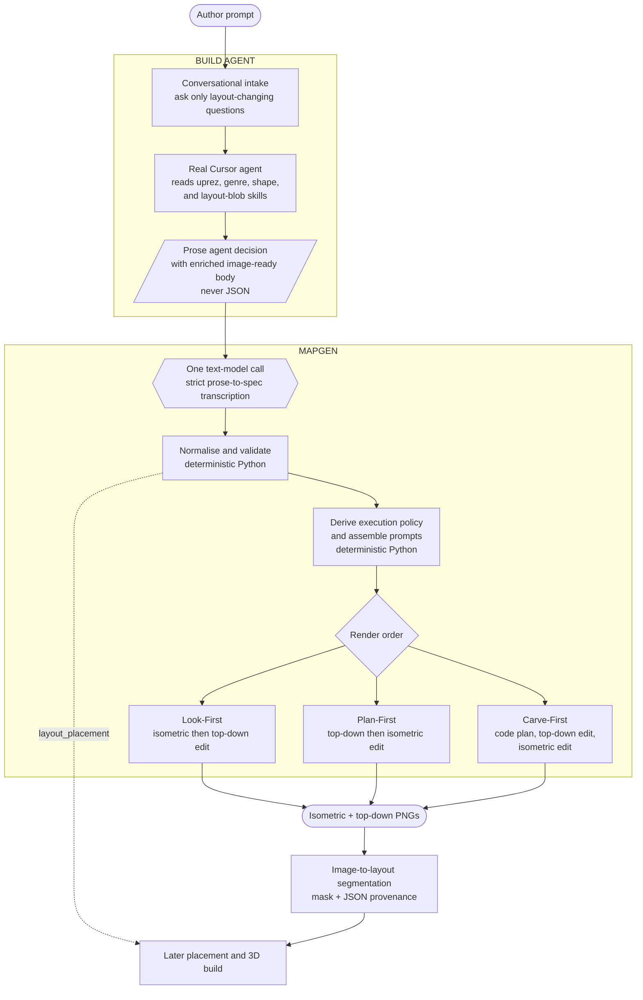

# LayoutGen pipeline overview

This is the canonical overview of the current `agent_gateway` production path in
`genre_specific_layout_generator`.

It describes the architecture we intend to deploy and the corrected 616-scene run
produced on 2026-08-13. Historical evaluation arms still exist in the repository, but
they are not the production workflow described here.

## One-paragraph version

The Build Agent talks to the author and runs a real Cursor agent that reads the full
LayoutGen skills. That agent combines the raw author prompt and intake answers into one
enriched image-ready scene body while deciding the layout in prose. MapGen receives only
that self-contained prose decision, then makes exactly **one text-model call** through
Roblox LLM Gateway to transcribe it into strict JSON. Python deterministically normalises
the spec, derives execution policy, and assembles the image prompts. GPT Image 2 makes two
image calls to produce an isometric and a top-down view. Image-to-layout later segments
those images and stores the mask plus its JSON provenance.

The core contract is:

```text
author
  -> Build Agent intake
  -> Cursor agent decision in prose with one enriched scene body
  -> one strict Gateway transcription call
  -> deterministic Python
  -> two GPT Image 2 calls
  -> downstream image-to-layout segmentation
```

## Ownership boundary

| Owner | Responsibilities | Output |
| --- | --- | --- |
| Build Agent | Conversational intake, clarification, and the real Cursor-agent reasoning stage | Raw author input and answers become one self-contained prose decision |
| MapGen | One strict prose-to-spec call, deterministic normalisation, route/order policy, prompt assembly, and two image calls | Structured spec, prompts, isometric PNG, top-down PNG |
| Downstream image-to-layout | Semantic planning, mask generation, segmentation provenance, and later layout reconstruction | Segmentation mask and JSON artifacts |

The production handoff is the Cursor agent's self-contained prose decision. The Cursor
agent reads the original author prompt and intake answers while reasoning, and writes one
enriched image-ready scene body into that decision. The Gateway transcription call does
not receive a second scene-description input.

## Model-call budget

### Core MapGen work after the Cursor agent returns prose

| Call | Count | Purpose |
| --- | ---: | --- |
| Text model | **1** | Strict prose-to-layout-spec transcription |
| Image model | **2** | First view, then reference-conditioned second view |

The one text call is `blob.decouple(agent_prose)`.

It requires provider-enforced JSON Schema. If the Gateway does not support the schema,
the call fails closed. This production handoff does not retry with unconstrained prose
and does not use the permissive local JSON-extraction fallback. Ordinary JSON decoding is
still required to turn the HTTP response into a Python object; that is transport
decoding, not another reasoning or parsing stage.

`normalise`, route/order derivation, and prompt assembly are deterministic Python. They
are not LLM calls.

### Calls outside the core count

- Build Agent conversation and Cursor-agent reasoning use agents upstream of MapGen.
- Evaluation checklist extraction is a separate optional text-model call. It runs only
  when a checklist is missing or regeneration is forced. The corrected 616-scene render
  reused existing checklists, so it made no new checklist calls.
- Image-to-layout segmentation has its own semantic-plan and mask-generation calls. They
  are downstream and are excluded from the core MapGen count above.

## Pipeline diagram



## Stage 0 — Build Agent intake

**Owner:** Build Agent.

The Build Agent is the only component that talks to the author. It uses
`.cursor/skills/layout-intake/` for dispatch and `.cursor/skills/genre-choice/` when
intake routes a layout concern there. Goal or win condition is not collected unless it
changes spatial shape.

The corrected corpus inputs are seeded by `tools/make_agent_inputs.py`, which projects
only the raw `source` and author `answers` from `results/routing/answered/` into
`results/routing/agent_input/`. It does not copy a model-written intermediate or expose
another arm's classification.

## Stage 1 — Cursor agent decides in prose

**Owner:** Build Agent.

This is the deciding stage. It is a real Cursor agent, not `blob.describe()` and not a
normal Gateway completion.

The agent contract is in `tools/agent_task.md`. The agent reads:

1. `.cursor/skills/layout-intake/SKILL.md`;
2. `.cursor/skills/uprez-prompt/SKILL.md`;
3. `.cursor/skills/genre-choice/SKILL.md`;
4. `.cursor/skills/genre-choice/shapes.md`;
5. the selected genre file, or `no-genre.md`;
6. `.cursor/skills/layout-blob/SKILL.md`.

Per scene it reads `results/routing/agent_input/<SCENE>.json`, which contains the original
source prompt and intake answers. It writes:

```text
results/routing/agent_blob/<SCENE>.md
```

The artifact has one outer section:

```markdown
# Agent decision
<nine prose sections>
```

The nine decision sections are:

1. Clarifications resolved
2. Enriched image prompt
3. Genre
4. Shape and preset
5. Config requirements
6. Layout requirements
7. Layout components
8. Render order
9. Scale, theme, and pipeline cost

The first section records every layout-changing question and answer used. Existing intake
answers are labelled `author`; in an offline batch, necessary unanswered questions receive
the narrowest grounded answer and are labelled `agent_inferred`. The second section is one
or two image-ready paragraphs synthesized from the original message, those resolutions,
and the visible spatial decisions the agent makes. This enriched prompt is the sole scene
body accepted by rendering. Author answers override conflicting details in the original
message. The agent names canonical IDs in backticks in the remaining sections and writes
English prose rather than JSON. The separation is deliberate: the agent decides; the
Gateway only encodes the decision.

## Stage 2 — One strict Gateway transcription call

**Owner:** MapGen.

`tools/build_agent_arm.py` extracts only the `# Agent decision` section and calls:

```python
spec = blob.decouple(prose_decision)
```

`blob.decouple` sends:

- the transcription-only system instruction;
- the canonical menu;
- the prose decision;
- `LAYOUT_SPEC_SCHEMA` as a required strict response schema.

The transcriber must:

- copy decisions rather than reconsider them;
- preserve clarification provenance and never label an agent inference as author input;
- never invent missing options, placements, or counts;
- preserve canonical shape and option IDs;
- keep image-visible and post-segmentation placement work separate;
- translate scene-specific option wording into English without changing meaning;
- emit every required schema field.

The production call uses `require_schema=True`. If provider-side schema enforcement is
unavailable, the scene fails rather than falling back to a loose answer and a custom
parser.

The output is a structured layout spec containing:

- `clarifications[]`, with `author` or `agent_inferred` provenance;
- `initial_scene_subprompt_enriched`, copied verbatim from the agent's enriched section;
- `genre` and `secondary`;
- one shared-catalogue `shape`, or axes for No Genre/described shapes;
- `preset`;
- `options[]` with scene-specific wording, visibility, and counts;
- `layout_placement[]` with counts and siting rules;
- structured layout composition, zones, paths, terrain, props, boundary, scale, theme;
- render metadata;
- route claims;
- notes.

## Stage 3 — Deterministic normalisation

**Owner:** MapGen. **Model calls:** none.

`blob.normalise(spec)` enforces relationships that JSON Schema alone cannot express. It:

- clears a shape from No Genre;
- clears non-default axes when a shape already defines them;
- migrates the 12 retired shape IDs;
- drops options that do not belong to the selected genre;
- reconciles `options`, `visible`, and `layout_placement`;
- clears unknown presets to `none` and records a note;
- derives `render.then` and aligns `render.authoritative`;
- reconciles `SET` and `set_piece`;
- ensures an empty route becomes `["P0"]`;
- records every repair in `notes`.

This is validation and policy enforcement, not another prose parser.

## Stage 4 — Deterministic route, order, and prompt assembly

**Owner:** MapGen. **Model calls:** none.

`mapper.build(spec)` uses `initial_scene_subprompt_enriched` verbatim as the image-prompt
body, appends the canonical Build.md shape and visible-option requirements, and then adds
the deterministic camera/style wrapper appropriate to the selected order. The enriched
paragraph supplies scene-specific context; the catalogue addendum is retained as a
coverage guarantee so a selected layout rule cannot disappear during enrichment.

The enriched field is mandatory. If it is absent or empty, the mapper fails closed rather
than silently substituting a different scene description.

Only visible geometry reaches the image prompts. Trigger volumes, spawn markers,
checkpoints, pickups, emitters, and other post-segmentation work remain in
`layout_placement`.

Execution follows the agent's transcribed `render.first` decision unless a supported maze
or racing-route generator exists. In that case deterministic authored-plan generation is
mandatory and overrides an image-first selection. Route modifiers remain on the spec for
downstream pipeline costs and validation.

| Order | Trigger | Sequence |
| --- | --- | --- |
| Look-First (`std`) | Agent writes `isometric` | Text → isometric → top-down edit |
| Plan-First (`p6`) | Agent writes `topdown` | Text → top-down → isometric edit |
| Carve-First (`layout`) | A supported maze/track carver exists | Deterministic plan → top-down edit → isometric edit |

All three orders make two image-model calls. Carve-First additionally creates its first
plan in code. An unsupported `authored_plan` request safely degrades to image-model
top-down first and records a mapper note.

## Stage 5 — Render the two images

**Owner:** MapGen.

`layoutgen.backends.images.generate` uses GPT Image 2 at 1024×1024.

- The first image is generated from text, except Carve-First where it is an edit of the
  deterministic plan.
- The second image is always a reference-conditioned edit of the first rendered view.
- Edit prompts declare the first image immutable geometry: counts, footprints, positions,
  orientations, adjacency, boundaries, paths, doors, and openings must not change.
- Scene text supplied with an edit identifies objects and appearance only; it must not be
  used to re-solve or regularize the reference layout.
- Isometric outputs use a steep elevated oblique camera without yawing the footprint:
  the plan stays axis-aligned rather than rotating into the usual 45-degree diamond.
- References are padded to square and resized before upload.
- Files are written atomically so a partial PNG is never mistaken for a completed stage.

The current image backend defaults are:

| Setting | Default |
| --- | --- |
| Deployment | `gpt-image-2` |
| Endpoint | `https://rbx-mlp-east-us-2.openai.azure.com` |
| Size | `1024x1024` |
| API version | `2025-04-01-preview` |

## Stage 6 — Image-to-layout segmentation

**Owner:** downstream image-to-layout pipeline.

The segmentation job consumes the existing isometric and top-down images:

```bash
i2l pipeline run <run_dir> \
  --images-only \
  --backend gpt-image-2 \
  --image-size 1024
```

The top-down image is authoritative for geometry. The isometric image supplies identity
and appearance context. The job retains:

- `isometric.png`;
- `topdown.png`;
- `seg_mask.png`;
- semantic-plan JSON;
- mask-generation attempts and accepted-stage JSON;
- timings and other generation provenance.

`layout_placement` is not applied by this segmentation-only command. A later consumer
must place invisible/non-geometric requirements against the segmented geometry and build
the final 3D level.

## Shared shape catalogue and routing

The current catalogue has 45 shared shapes. Every shape is reachable from every genre;
a genre's `typical` list is presentation and defaulting, not a restriction. Routes live
on the shared catalogue rows rather than being redefined per genre.

When no catalogue row fits, a described shape carries no shape ID and answers the five
routing axes directly. The rejection rationale belongs in the agent prose so the choice
can be audited.

Twelve retired IDs are migrated through `docs/shape-migration.json`. This is a rename,
not a new model decision.

## Current production artifacts

The corrected batch contains 616 completed scenes. `P0569` was excluded because its
source was an asset-ID-only prompt without a usable scene description.

Render-order distribution:

| Order | Scenes |
| --- | ---: |
| Look-First (`std`) | 494 |
| Plan-First (`p6`) | 88 |
| Carve-First (`layout`) | 34 |

Canonical S3 root:

```text
s3://3dfm-data/users/elaineh/layoutgen/results/scenes/agent_gateway_260813/
├── iso/P####.png
├── td/P####.png
├── plan/P####.png
├── seg/P####.png
├── i2l/P####/
│   ├── isometric.png
│   ├── topdown.png
│   ├── seg_mask.png
│   ├── plan/
│   └── generation/
├── segmentation_manifest.jsonl
└── segmentation_manifest_summary.json
```

Verified corpus totals:

| Artifact | Count/status |
| --- | ---: |
| Isometric images | 616 |
| Top-down images | 616 |
| Deterministic plans | 34 |
| Flattened segmentation masks | 616 |
| Complete i2l scenes | 616 / 616 |
| Segmentation quality-gate pass | 603 |
| Best retained after soft-gate failure | 13 |
| i2l artifacts | 8,247 |
| i2l bytes | 2,816,369,533 |

The detailed manifest is:

```text
s3://3dfm-data/users/elaineh/layoutgen/results/scenes/agent_gateway_260813/segmentation_manifest.jsonl
```

## Evaluation checklist

Evaluation checklist extraction is not a production MapGen stage.

`layoutgen/evaluate/checklist.py` makes one text-model call with a JSON Schema only for a
scene whose checklist is missing, unless forced. Unlike `blob.decouple`, it does not pass
`require_schema=True`, so the Gateway may fall back to locally parsed JSON when
provider-side schema enforcement is unavailable. Checklists are stored under:

```text
results/eval/<SCENE>.json
```

All 616 corrected scenes already had checklists during the final render, so this batch
made zero new checklist calls.

## Production entry points

The corrected local batch path is:

```bash
# 1. Cursor agents write prose artifacts according to:
tools/agent_task.md

# 2. One strict Gateway transcription per artifact:
python tools/build_agent_arm.py

# 3. Render the corrected source. Missing checklists are backfilled unless
#    --no-checklists is supplied. --arm agent_gateway is already the default:
python -m layoutgen.pipeline.golden --arm agent_gateway

# 4. Downstream segmentation:
python tools/run_i2l_segmentation.py

# 5. Corpus manifest:
python tools/build_segmentation_manifest.py
```

`python tools/build_pipeline_viewer.py` writes `results/pipeline_viewer.html`. It reads
`results/routing/agent_spec_gateway`, `results/runs/agent_gateway.jsonl`,
`results/eval/<SCENE>.json`, and image URLs under the versioned
`results/scenes/agent_gateway_260813/` route.

## Text backend

The text abstraction is `layoutgen.backends.llm.ask(system, user, schema)`.

| Setting | Default |
| --- | --- |
| Provider | `gateway` |
| Gateway environment | `production` |
| Gateway model | `gpt-5.5` |
| Gateway max output tokens | 8192 |
| Retries | 3 |
| Timeout | 300 seconds |

The production blob transcription additionally sets `require_schema=True`; it cannot use
the degraded, locally parsed fallback. `LAYOUTGEN_GATEWAY_MODEL` can override the model
for comparisons or rollback.

The Azure alternative sends `seed=7`. The default Gateway path sends no seed, so normal
Gateway runs are not seed-reproducible.

## Historical evidence

Legacy generated routing records and comparison results may remain under `results/` as
evidence, but their executable front-half workflows are no longer production entry
points. The old `uprez → describe → decouple` runner, direct-JSON agent arm, blob arm,
and non-production golden render arms have been removed.

The production implementation exposes only Cursor-agent prose → strict `decouple` →
deterministic assembly. Archived records must not be used to count production calls or
describe production ownership.

## Cube-generation worker contract

The intended Cube/MapGen boundary is:

```text
Build Agent supplies:
  Cursor-agent prose decision
  including the enriched image-ready scene body

MapGen performs:
  one strict prose-to-spec activity
  + deterministic assembly
  + two image activities
```

Accordingly:

- a MapGen scene-uprez activity duplicates Build Agent work;
- a MapGen layout-blob/deciding activity duplicates the Cursor agent;
- MapGen should begin at the strict layout-spec transcription activity.

Claims about a particular Cube branch, PR, activity timeout, or deployed model must be
verified in the Cube repository itself. They are not facts this repository can establish.

## Invariants

1. The real Cursor agent decides; the Gateway transcribes.
2. The prose artifact is never JSON.
3. After the prose handoff, MapGen makes one text-model call.
4. The MapGen transcription call (`blob.decouple`) requires provider-enforced JSON
   Schema and fails closed; downstream checklist extraction is separate and may degrade
   locally.
5. Deterministic Python owns normalisation and prompt assembly.
6. Invisible placement requirements never enter image prompts.
7. Every scene produces exactly two rendered views.
8. The second rendered view is conditioned on the first.
9. Segmentation keeps a matching mask and JSON provenance.
10. Production artifacts use a versioned S3 prefix.

